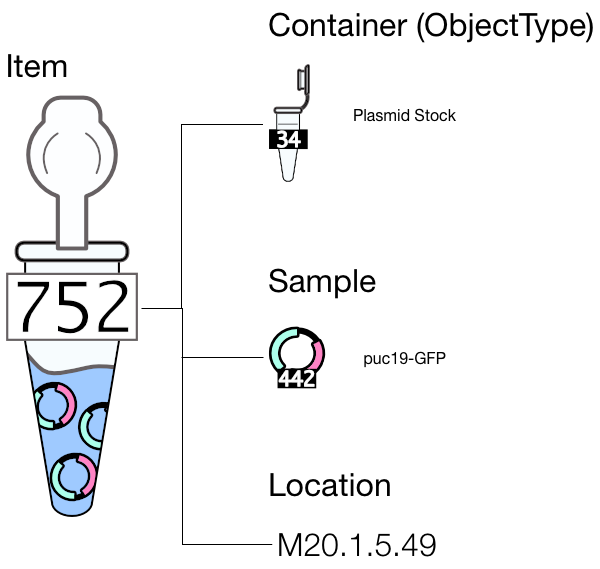
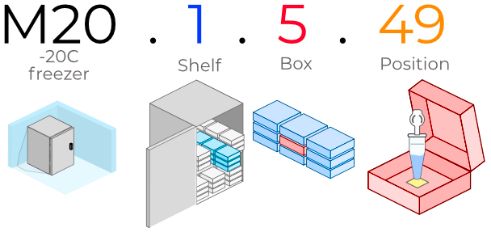
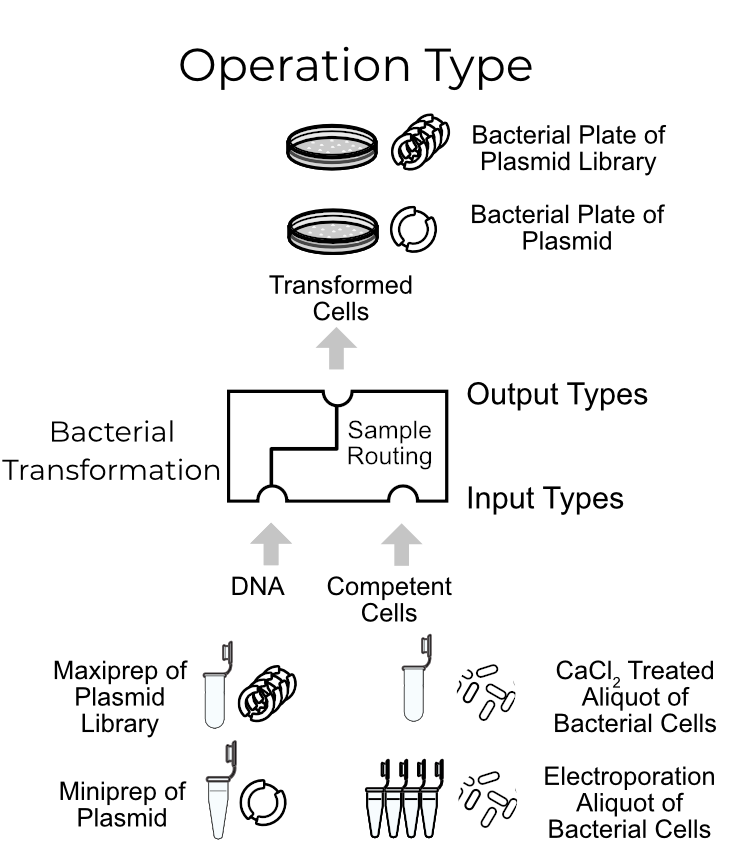
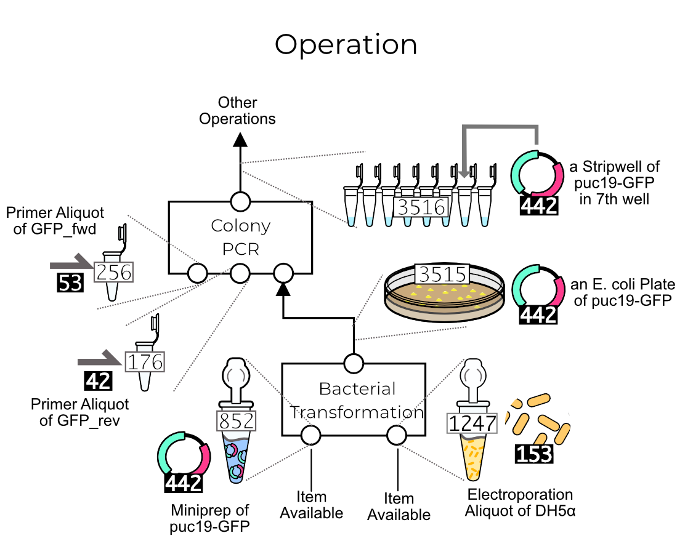
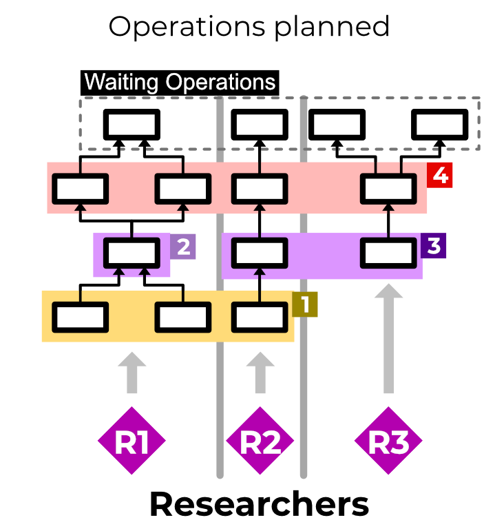
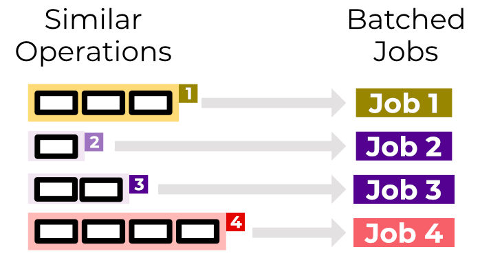
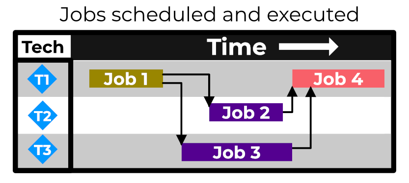

# Aquarium Concepts

This document introduces the basic concepts of Aquarium.
More details are given in relevant sections of the documentation.

## Items

Aquarium protocols maninpulate items in the LIMS inventory.
An _item_ represents a physical entity in the lab.
For instance, this diagram represents a GFP-tagged plasmid in a glycerol stock in a eppindorf tube located in a freezer.

Each item has three components representing these details: the sample, the object type, and the location.
For the example in the diagram, these are

- the plasmid puc19-GFP (the sample),
- in a glycerol stock in an eppindorf tube (the object type), and
- stored in a freezer (the location).

A _sample_ is effectively the class of entity for which the item is an instance, and has a _sample type_.
Here the sample is puc19-GFP, which has sample type of plasmid.

An item *location* in Aquarium is a hierarchical description of where the item can be found.
For instance, the UW BIOFAB location `M20.1.5.49` is a location in a box in a -20C freezer as illustrated by this diagram:

## Operations

A protocol performed in Aquarium is represented as an _operation_.
Concretely, an operation is defined by an _operation type_ that indicates how the operation will be performed, and is defined by a protocol script that takes inputs and produces outputs.
This diagram illustrates an operation type for bacterial transformation, which takes DNA and competent cells as inputs and performs a transformation to produce transformed cells.

One of the key details of this operation type is that can be given different types of inputs as long as they are consistent with the type in the operation type.
In the diagram, the DNA input could be either a Maxiprep of Plasmid Library or a Miniprep of Plasmid Library.
The type of the output depends on the types of the inputs.

An _operation_ is a particular instance of an operation type with concrete inputs and outputs.
This is illustrated in this diagram, which The diagram shows the bacterial transformation operation where the inputs are identified with particular items that exist in the inventory.

An operation occurs in a _plan_, which is a set of operations with linked inputs and outputs.
The diagram shows the output of the bacterial transformation operation linked to an input of a colony PCR operation.

## Jobs

When plans are executed in Aquarium, similar operations are batched together as a _job_.
These operations may come from different plans of different researchers as illustrated here where three distinct plans have shared operations.

Operations that are ready at the same time can be grouped into jobs by the manager.
Here the operations are batched into four jobs.
The manager can batch operations in to jobs as needed – in this case, the manager chose to create jobs 2 and 3 separately even though the operations have the same operation type.

Jobs are then scheduled and assigned to a technician to perform.

