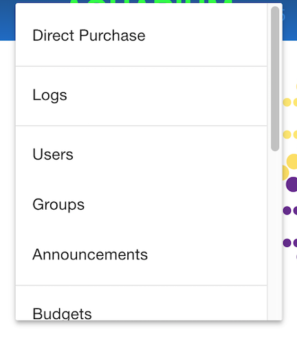
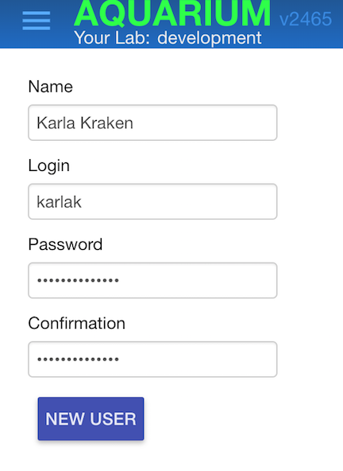
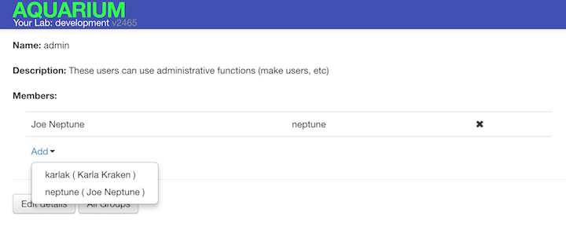

# Aquarium Configuration

## Table of Contents

<!-- TOC -->

- [Aquarium Configuration](#aquarium-configuration)
    - [Table of Contents](#table-of-contents)
    - [Practical Considerations](#practical-considerations)
    - [Installing Aquarium](#installing-aquarium)
    - [Starting Aquarium](#starting-aquarium)
    - [Create an Aquarium Account](#create-an-aquarium-account)
    - [Adding users in Aquarium](#adding-users-in-aquarium)
    - [Building the Inventory](#building-the-inventory)

<!-- /TOC -->

## Practical Considerations

We recommend that labs doing protocol development run at least two instances:
the first, a "nursery" server that is shared within the lab for the purposes of trying out protocols under development, while the second is the production server that controls the lab.
We use this arrangement in the Klavins lab to run the UW BIOFAB so that protocols can be evaluated without messing up the actual lab inventory.
In addition, each protocol developer should run a local instance, which can be done easily with Docker.

## Installing Aquarium

These are the instructions to install Aquarium from the [source code](https://github.com/klavinslab/aquarium).
If you are doing either protocol development or Aquarium development, we recommend you run Aquarium from Docker.

1.  Ensure you have the following installed on your machine

    - A Unix-like environment, e.g. Mac OSX or Linux
    - [git](https://git-scm.com)
    - [Ruby](https://www.ruby-lang.org/en/) version 2.3.9
    - [npm](https://www.npmjs.com/get-npm)
    - A [MySQL](https://www.mysql.com) server (optional for a full, production level installation)


2.  Get the Aquarium source code by either downloading the [latest release](https://github.com/klavinslab/aquarium/releases/latest) and uncompress, or cloning the working master branch with the command

    ```bash
    git clone https://github.com/klavinslab/aquarium.git
    ```

    If you choose to download the latest, uncompress the file.

3.  Configure Aquarium by first creating the `aquarium/config/initializers/aquarium.rb` file

    ```bash
    cd aquarium/config/initializers
    cp aquarium_template.notrb aquarium.rb
    ```

    and then editing `aquarium.rb` to set the URLs and email address.

4.  Configure the Aquarium database settings. First, create the `aquarium/config/database.yml` file with

    ```bash
    cd ..  # aquarium/config
    cp database_template.yml database.yml
    ```

    This will configure Aquarium to use the default database for _development_ mode.
    You may configure different database servers for different modes.
    If you want to use MySQL, you will need to set up the server, and associate a username and password.
    Though, the `test` mode for testing Aquarium system tests should use the `sqlite3` server.

5.  Install the Ruby gems required by Aquarium with

    ```bash
    gem install bundler
    bundle install
    ```

    Note that if you are using MySQL, and the database is not installed or not properly installed, you may get errors during this step.

6. Install Javascript libraries used by Aquarium with the command

    ```bash
    npm install -g bower
    bower install
    ```

7.  Initialize the database with

    ```bash
    RAILS_ENV=development rake db:schema:load
    ```

    You can also set `RAILS_ENV` to `production` or `rehearse` in place of `development`.
    Any mode that is specified in `database.yml` is okay.

8.  If you are working with a production or rehearse server, then you need to precompile the assets:

    ```bash
    RAILS_ENV=production bundle exec rake assets:precompile
    ```

## Starting Aquarium

To start Aquarium, run

```bash
RAILS_ENV=development rails s
```

and then go do `http://localhost:3000/` to find the login page.

This procedure starts a _development_ mode version using the local SQL database in the db directory.
This could be enough for some labs.

To run protocols within Aquarium, ou will also need to start the Krill server with the command

```bash
rails runner "Krill::Server.new.run(3500)"
```

(The port for the Krill server is set in `config/initializers/aquarium.rb`.)

## Create an Aquarium Account

To create the first administrative user run the commands

```bash
RAILS_ENV=production rails c
load 'script/init.rb'
make_user "Your Name", "your login", "your password", admin: true
```

from the `aquarium` directory.

## Adding users in Aquarium

Once you have an account you can create other users by choosing `Users` in the menu at the top left of the Aquarium page:



Then enter the user information and click **New User**



This will bring you to the user information page where user contact information should be entered:


The exclamation points on this page indicate that the user hasn't provided contact information, and has not agreed to usage terms.
The user will need to login separately to agree to the usage terms.

A user must have administrative priviledge to access the protocol development tools.
For this, choose **Groups** from the settings menu, choose the group, and then click add:



Also, a user must have an associated budget to run any workflows.

## Building the Inventory
