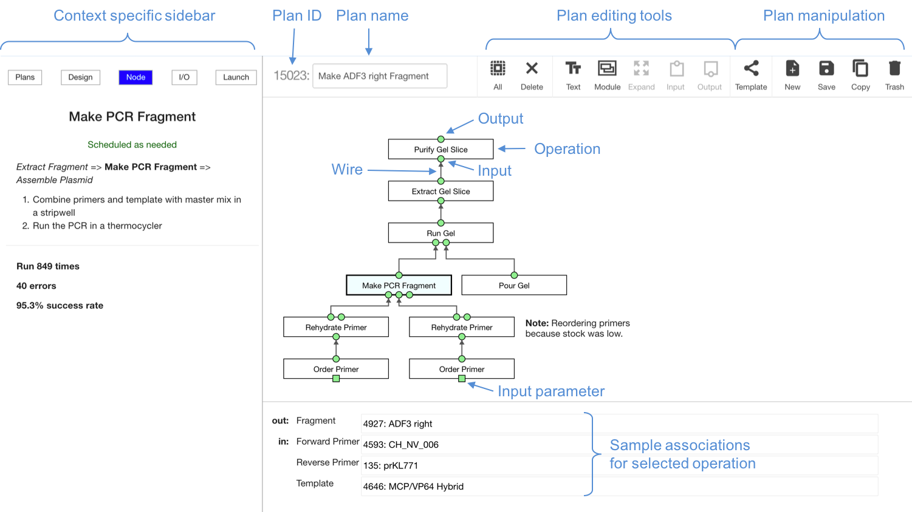
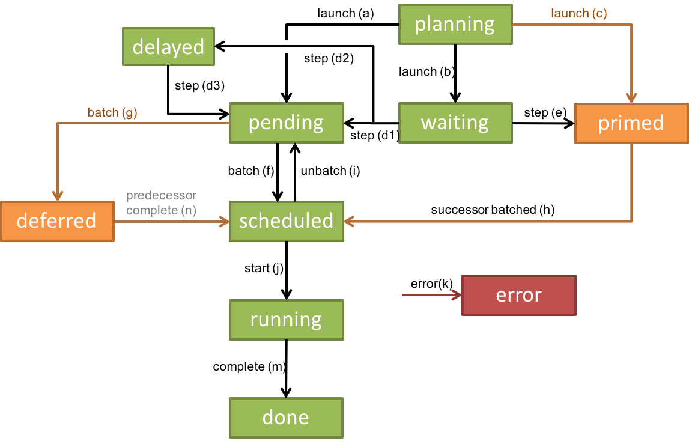

<!--
  Written by Eric Klavins, July 2018
  -->

# Plan Designer

The plan designer allows you to string together operations to be applied to your samples. You can create complex experimental workflows, a.k.a. plans, with dozens of steps, associate specific samples and items from the inventory with their inputs, send the output of one operation to the input of another, estimate how much your plan will cost, monitor the progress of your plan as it is executed, and more. This document describes how to use every feature of the plan designer. It uses the operation types in Cloning workflow, which is included in the distribution of Aquarium, as examples. Once you add your own operation types (using the Developer), you should be able manipulate them the same way. Besides the existence of the Cloning workflow in the designer, this document assumes you have populated the inventory with samples and items that can be used for the inputs of plans. If not, you will need to add such inventory and reload the Designer.

<!-- TOC -->

## Table of Contents

  - [Loading the Designer](#loading-the-designer)
  - [Manipulating plans](#manipulating-plans)
  - [Building new plans](#building-new-plans)
  - [Using modules](#using-modules)
  - [Using templates](#using-templates)
  - [Launching plans](#launching-plans)
  - [Viewing progress](#viewing-progress)
  - [Data associated with a plan](#data-associated-with-a-plan)
  - [Editing plans](#editing-plans)

## Loading the Designer

**Click on "Designer" on the main menu bar**: This should bring up the designer view, with the "Plans" tab highlighted on the left and the "Under Construction" folder of plans opened.

**Edit an existing plan**: In the Plans view, open a plan, click on the menu on the upper right of the opened plan, and choose "Edit/Design". This should bring up the designer view with the plan you chose already open. The "Plans" tab should be highlighted, the folder containing the plan should be open, and the plan id and number of the plan should be highlighted in orange.

## Manipulating plans

**Create a new plan**: Click on the `New` icon on the upper right of the designer. If you have an existing plan open, the designer will ask if you would like to save it first. Click Yes or No. The new plan will be empty and titled "Untitled Plan". At this point, the plan exists only in your browser, and has not been saved. Navigating away from it before saving it will discard your work.

**Rename a plan**: The name of the plan appears at the top of designer in an editable input box. You can change the name to whatever you want. The new name will not be saved unless you click the `Save` icon.

**Save a plan**: Click the `Save` icon. Your plan will be given an ID number, which shown next to the plan's name. The plan ID and name will also show up at the top of the Unsorted folder on the left when the `Plans` tab is selected, and it will be highlighted in orange, indicating that the plan is open.

**Open a plan**: All of your plans are listed in the folders on the left when the `Plans` tab is selected. New plans are automatically put in the "Under Construction" folder. Once a plan is launched (see below), it will be moved to the "Unsorted" folder. Other folders may be present as well. To open a folder and find a plan you would like to open, click the triangles next to the folder names to open them. To open an existing plan, click on the name of the plan in the list. To open a plan, click on the name. You will be prompted to save whatever plan is currently open before the plan you clicked on is loaded. Only one plan at a time can be open in the designer.

**Copy a plan**: To make a copy of a plan, open it and then click the `Copy` icon on the upper right of the designer. This will make a new plan, with a new ID, with the same name as the existing plan but with `(copy)` append to the name. It will close the source plan and open the new plan. If any operations in the source plan are active, the copies of those operations in the new plan will be put back into the "planning" stage.

**Delete a plan**: Only plans that have not been launched can be deleted. You can either click the &times; symbol next to the plan's name in the "Under Construction" folder, or you can open the plan and click the `Trashcan` icon. A dialog box asking if you are sure you would like to delete the plan should be presented to you.

**Move a plan**: Any plan that has been launched (i.e. it is not in the "Under Construction" folder) can be moved to another folder. To do so, select the plan (or plans) you would like to move by clicking in the checkbox next to the name of the plan and then clicking the &#8680; icon. Choose the destination folder from the dropdown menu showing names of existing folders, or choose "New Folder" to create a new folder with the selected plans it in.

**View/Edit another user's plans**: If you are in the `admin` group, you can view and edit another user's plans by choosing their user name from the list of user names at the bottom of the left sidebar when the "Plans" tab is selected. When acting as another user, the left sidebar will show the name of that user highlighted in yellow.

## Building new plans

**Add operations**: To add operations to a plan, select the "Design" tab on the left sidebar. Then select "Operation Types" and a category of operation type, for example, "Cloning". You should see a list of operation types in that category. Click on one of them to add an operation of that type to your plan. For example, add "Order Primer" and "Rehydrate Primer" to a new plan. The operations will be placed in the plan workspace in somewhat arbitrary positions. Move them so that "Rehydrate Primer" is above "Order Primer".

> Note: The flow of information in an Aquarium plan is from the bottom of the screen to the top. Thus, the goal of your plan should be put at the top of the workspace and then first operations to be performed should be put at the bottom of the workspace.

Selected operations will appear light blue. When you select an operation, information about the operation and how to use it will be shown in the left sidebar when the "Node" tab is selected. You can select multiple operations by dragging a selection box around them using the mouse.

> Note: If you have not yet named your plan, the plan will given the same name as the first operation you add to the plan. You can always change this name later.

**Deleting operations**: To delete an operation, select it and click the `Delete` icon or press the "Delete" key on your keyboard. If multiple operations are selected, they will all be deleted. You cannot delete an active operation from a plan (although you can disconnect it and move it to the side).

**Add wires**: To connect the output of an operation to the input of another, first select the desired output of the first operation. A pulsating circle will be place around the output and all inputs of other operations that are compatible with the output type of the first operation will appear cyan in color. Shift click one of these inputs and an arrow will connect the output to the input, indicating that they are now "wired" together. You can also first select an input and shift click on another output to wire operations together. For example, in a plan containing just "Rehydrate Primer" and "Order Primer", connect the output of "Order Primer" to the input of "Rehydrate Primer".

> Note: Wires appear black if the I/O pins they connect are compatible. Otherwise, they appear orange. This occurs if they have different samples associated with them or if they have different Sample Type / Container Types chosen for then (see below).

**Associate samples with I/O pins**: Select an input or an output circle, or an entire operation. At the bottom of the designer a list of all the inputs and outputs will appear. Start typing the name of a sample in one of the boxes. A list of samples whose names autocomplete what you have typed so far, and which are compatible with the input's sample type definition (defined in the Developer) will appear. Select one of the samples. At this point, the sample will be associated with the input or output **and** with all inputs and outputs the designer determines should have the same sample associated with them. For example, with the "Rehydrate Primer" and "Order Primer" operations wired together, the following inputs and outputs are considered "Equivalent" in terms of assigning samples: the "Primer" output of "Order Primer", the "Primer" input, the "Primer Aliquot" output and the "Primer Stock" outputs of "Rehydrate Primer". Assigning a sample to any one of these I/Os wil automatically associate the sample with the others.

> Note: In general, I/O pins are considered equivalent for assigning samples if (a) they are connected to each other or (b) they have the same routing id as defined in the definition of the operation type in the Developer.

> Note: When an output has a sample associated with it, it will appear green, indicating that it is valid. If an input is not a "leaf" input (meaning there is a wire coming into it), the associating a sample with it will also turn it green. A leaf input will be green only if it has a sample and has an item associated with it (see below). If an I/O is not green it will show as orange, indicating that more information for that I/O is required before the plan can be launched.

**Editing input parameters**: Inputs to operations can also be numerical, string, or JSON values. For example, the input to "Order Primer" is a string "Yes" or "No", which you can choose from the "Urgent" select box at the bottom of the designer when the "Order Primer" operation is selected.

> Note: The Designer page needs to be reloaded for it to see new samples. New items should show up if you simply reload the plan (using the Reload button in the main menu). If not, try saving your plan and reloading the page.

**Associate Items**: Selecting an input will bring change the sidebar to "I/O". Two lists are shown. First, a list of all "Sample Type / Container Type" pairs will appear. If there are more than one (as defined in the Developer for the operation type), you can choose which one to use. The autocomplete for the sample name will respect the choice. Second, a list of inventory items associated with the chosen Sample Type / Container type will appear, along with their locations. When you assign a sample to an unwired input to an operation, the designer automatically chooses the first item in this list to associate with the input. You can choose a different one by clicking on the checkbox next to the item ID. You can click the item ID itself to view more information associated with the item. Inventory for wired inputs and outputs is displayed, but you cannot change it. Typically, the an operation will create new items for its outputs.

The "Rehydrate Primer" input is of type Primer  with container type set to Lyophilized Primer, so cannot be changed. Furthermore, lyophilized primers are turned into primer stocks by the operation, so typically there will be no inventory for this input (which is why it is wired to "Order Primer"). An example of an operation operation with multiple input types is the "Template" input of the "Make PCR Fragment" operation. Try adding such an operation and changing the Sample Type / Container Type for the "Template" input to "Fragment / Fragment Stock" and seeing which samples are available in the autocomplete.

**Associate parts of collections**: The inputs to some operations are defined to be parts of larger collections of parts. For example, a lane in a gel or a well in a 96 well plate. Here, you can select not only which collection to use from the inventory, but also which element of the collection. For example, add a "Transform Cells" operation to your plan and set the "Comp Cells" input to "DH5apha". If you have any inventory, you will see a list of collections on the left. Next to each collection is a matrix of squares that are light blue if they have a matching sample in them. Click on one of them to select which element (or part) of the collection you would like to use.

> Note: At this time Aquarium does not check that an item or an element of a collection is not used more than once in a plan. You should check this by hand if it is required.

**Use array inputs**: Some operations have input and output arrays of elements when it is not defined a priori how many samples they operate on. For example, add an "Assemble Plasmid" operation to your plan. Select the operation and note the "Add" button underneath the "Fragment" Input. Click it and you will see another Fragment input appear. You can operate on these inputs just as you would a normal input. You can delete one of them by clicking the &times; symbol on the right of the input's sample box at the bottom of the designer.

**Adding predecessors and successors**: The types of inputs and outputs of operations have to match, and Aquarium uses the information to help you construct plans. For example, select an input to the "Assemble Plasmid" operation and associate a sample with it. Notice that with this input selected, a list of "Predecessors" for the "Assemble Plasmid" operation appear, in this case "Extract Gel Slice" and perhaps "Extract Gel Slice (Advanced)". The preferred predecessor will have a blue button next to it. Click it and a new operation will be added and wired to the input you selected. In addition, the sample information will be propagated to the new operation and the pulsating cursor will move to the first input of the new operation, where you can add another predecessor. In this way, plans can be constructed quickly. In a similar manner, you can add successors to outputs of operations.

**Annotating a plan with text boxes**: Clicking on the `Text` icon at the top of the designer will add a text box to your plan. You can move it and resize it. When a text box is selected, you can edit its contents at the bottom of the designer, where you can add any valid [Markdown](https://github.com/adam-p/markdown-here/wiki/Markdown-Cheatsheet) code (including plain text). You can even add images to your plan by linking images for example with

    

In addition, you can add images uploaded to Aquarium. For example, if you have a gel image associated with operation 12345 you can put the image directly in the plan by making a text box with the code

    

where 12345 is the operation id and "gel" is the name of the data association you want to view. Similarly, you can put images associated with items into plans with

    

## Using modules

Modules are a way to visually group together operations (and other modules) to reduce clutter and to encapsulate common functions. For example, if a particular set of five operations is almost always used together, you can make them into a module whos inputs are the inputs to the first operation in the set, and whose outputs are the outputs of the last operation in the set. Then yu can make it into a template (see below) and use it over and over again.

**Creating a module:** To create a new module, click the `Module` icon. A selected box will appear, representing the module. You can open it by right clicking on it or by clicking the `Expand` icon. Opeing the module will replace the workspace with the contents of the module (which is empty for a newly created module). You can close the module by clicking the &times; symbol on the upper right of the workspace.

**Editing the name and documentation for a module**: To change the name of a module and to edit the documentation associated with it, select the module, and click "Edit" on the left sidebar (assuming the "Node" tab is selected). You can change the name and edit markdown in the editor and save or discard your changes.

> Note: The "Save" button for the name and documentation for a module does not save the plan. you will also need to click the `Save` icon on the upper right to do that.

**Adding operations, inputs and outputs to a module:** With a module open, you can add operations and wires just as described above. In addition, you by clicking on the `Input` and `Output` icons you can add inputs and outputs to the module and connect then to the outputs and inputs of operations within the module. With the module closed, inputs and outputs will appear as colored circles, just as they do with operations. You can also add modules to modules, creating a hierarchy of sub-plans as it were.

**Turning a selection into a module**: You can quickly create a module by selecting any number or operations and modules and clicking the `Module` icon. Doing so will add the operations with the same connectivity to the module. Any operations in the selection that had unwired inputs will become inputs to the module, and any operations in the selection that had unwired outputs will become outputs of the module.

**Deleting modules**: To delete a module, selecting and click the `Delete` icon or press the Delete Key on your keyboard. Modules can not be deleted if they or any of their sub modules contain active operations.

## Using templates

**Using templates**: Templates are parts of plans that you would like to use over and over. For example, you might want create a plan with a PCR whose product is run through a gel and purified, which involves five operations connected together in a certain way. Repeatedly building this sub-plan would be a tedious, so a template can be used that already has this sub plan in it. To add a sub-plan from a template to your plan, click on the "Design" tab on the left sidebar and select "Templates" (made by you) or "System Templates" (made by others and shared) and click on a template. The template's contents will be added to your plan. Clicking multiple times adds multiple copies of the sub-plan.

**Creating templates:** To create a template, simply build a plan, give it a descriptive name, save it, and click the `Template` icon. A new entry will be put in the "Templates" folder under the "Design" tab. And you will be given an empty workspace to start editing a new plan.

**Promoting and demoting templates:** If you are in the admin group, you can share you templates with everyone else on the system by clicking the &#8679; icon next to the template name in the "Templates" folder. To revert a template (system or personal) back to a plan, click the &times; icon next to the template's name. This will move the template back into your "Unsorted" folder in the "Plans" sidebar.

## Launching plans

**Fixing validation errors**: While you are constructing a plan, none of the operations in it are visible in the manager view and therefore can not be scheduled or run. Before a plan can be launched, so that its operations can be executed, it must be completely valid. Visually, this means that all I/O pins are green and all wires are black (at every level, even deep inside nested modules). The following rules are used to determine validity:

- An unwired input is valid if it has a sample and an item associated with it, or if it is a part of a collection, has a collection, row and column associated with it.

- A wired input is valid if it has a sample associated with it.

- An output, wired or not, is valid if it has a sample associated with it.

- An input parameter is valid if it has a value associated with it. Note that JSON inputs are no validated for syntax errors, the operation type code must do that.

**Calculating costs**: Once a plan is valid, click the "Launch" tab on the left sidebar. Aquarium will respond by computing the costs of all the operations in your plan, which will be shown next to the operation's box in the workspace. The total cost will be shown in the sidebar. Note that this plan is an estimate. If the plan is canceled, or if operations are redone, then the total cost will change.

**Choosing a budget**: Under the data associations for the plan should be listed budgets available to you. If there are none listed, go to the "Budgets" page via the top left menu and add one, assuming you are an administrator. If not, ask an administrator to add a budget for you.

**Launching**: Once a budget is selected, click "SUBMIT". At this point your plan will be launched. All of the operations will turn grey, indicating they are active, with their status shown below them. The plan will be moved from the "Under Construction" folder in the "Plans" tab of the sidebar, to the "Unsorted" folder. All operations in the plan will be listed in the manager.

## Viewing progress

**Operation status**: When a plan is being constructed, the status of each of its operations are set to `planning` and they are not seen by the manager. When a plan is launched, the status of all its operations are changed according to the finite state machine below.

The transitions from state to state are triggered as follows:

|     | Action   | Conditions on operation                        | Events that trigger the action |
|:----|:---------|:-----------------------------------------------|:-------------------------------|
| a)  | launch   | Has no predecessors                            | User launches the plan         |
| b)  | launch   | Has predecessors                               | User launches the plan         |
| c)  | launch   | Is marked "on the fly" and has no predecessors | User launches the plan         |
| d1) | step     | All inputs are ready, predecessors are done, and precondition is **true** | Technician completes a job |
| d2) | step     | All inputs are ready, predecessors are done, and precondition is **false** | Technician completes a job |
| d3) | step     | All inputs are ready, predecessors are done, and precondition is **true** | Any event that updates the plan |
| e)  | step     | Is marked "on the fly" and all inputs are ready | Technician completes a job |
| f)  | batch    | Is pending | Manager batches operation into a job |
| g)  | batch    | Is pending but has an "on the fly" predecessor | Manager batches operation into a job |
| h)  | successor batched | Is marked "on the fly" and has successor that was batched into a job | Manager batches the operation’s on the fly successor (if there is one that is ready) into a job |
| i)  | unbatch | Is scheduled | Was removed from a job by the manager |
| j)  | start   | Is scheduled | Containing job is started by the manager of technician |
| k)  | error   | | Operation is canceled, containing job is canceled, job's protocol code sets the operation to "error", or job's protocol crashes |
| m)  | complete | Operation's job is running normally | Technician completes containing job |
| n)  | pred-complete | Is deferred | Operation's "on the fly" predecessor completes |

**Reloading plans**: When you are viewing an active plan in the designer and the state of some of the operations changes, those changes will not be reflected in the designer automatically. To see what is happening with the plan without reloading the entire page and navigating back to your plan, click the `Reload` icon.

## Data associated with a plan

**Viewing and associating values and files with a plan**: Once a plan is launched, the jobs containing the operations will associate data from instruments and technician input with the plan. This data can be viewed in the "Plan Info" tab (which replaces the "Launch" tab once the plan is launched) on the left. You can delete data (be careful!) by clicking on the trashcan icon. You can add new data by clicking "Add Data". Replace "key" with a short name for the data, and enter in text below that. Click the first icon to the right to save the data and the revert icon to undo changes. To upload a file, click the upload button and choose a file. Once it is uploaded, its name will appear. Change the key to a short name for the kind of file it is, and then save the data association.

**Viewing and associating values and files with an operation**: You can similarly edit and add data to operations by clicking on the operation. This will bring up information about the operation on the bottom of the designer page. Choose "Add Data" or "Upload" from the menu in the upper right of the operation information area.

**Viewing and associating values and files with an item**: Clicking on an item ID anywhere in the designer brings up an information dialog describing details about the item. You can edit or add data and upload files to associate with the item here, as well as move the item to a new location (be careful that you are actually moving the item in the lab to reflect this change).

## Editing plans

**Retrying operations**:

**Modifying a plan's connectivity**:

**Adding new operations**:

**Canceling an operation**:

**Modifying which items are used by an operation**:

**Stepping (i.e. updating) a plan**:
