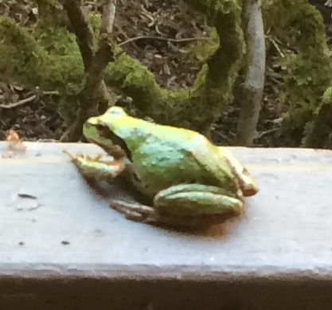

# Experimental Plan Designer

This document should outline, for each scenario/task that a researcher/experimental planner has to perform, how the user uses the Aquarium interface.

Images should go into the `docs/designer/images` directory and be referenced as
