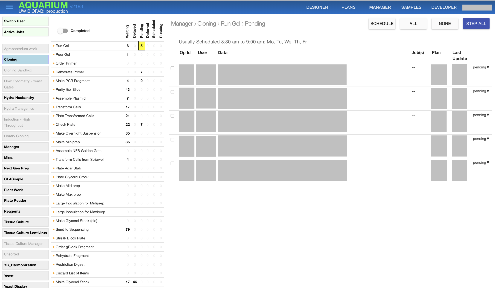
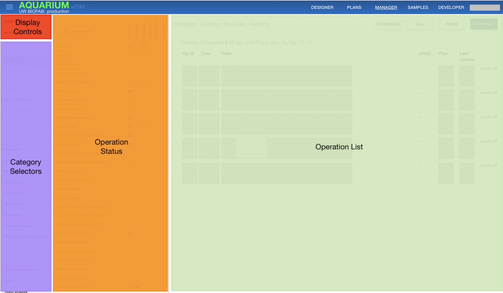
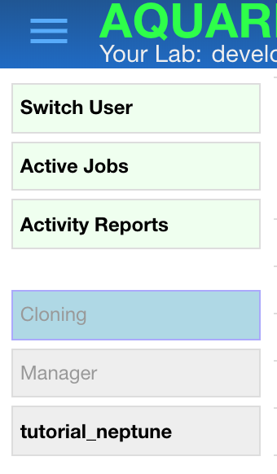
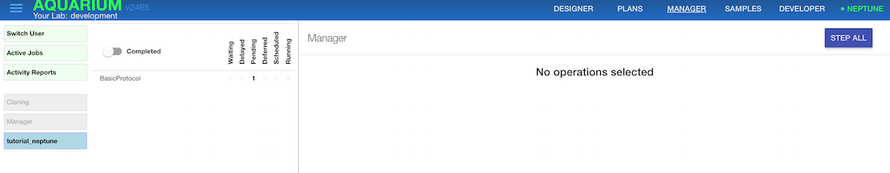
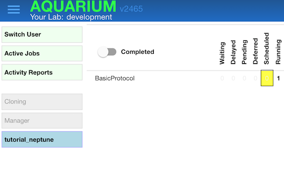

# Manager

*This document assumes that you have read the [Aquarium Concepts](../concepts/) document*

A manager uses Aquarium to determine which operations are run together as a job, and to monitor how jobs are progressing.
A *job* is simply a batch of operations of the same operation type that are performed together.

## The Manager Tab

The manager tab provides the information needed to manage lab operations as illustrated by this (redacted) screenshot of the manager tab for the UW BIOFAB production server.

The controls at the left of the screen allows the manager to determine which operations are displayed on the right.

The far left of the screen provides controls that determine what information is displayed.

The buttons at the top allow the manager to filter the 

## Using the Manager View to monitor lab activity

The left panel of the manager view has two parts.
At the top are buttons that allows the manager to do common tasks they perform: switching to another user, displaying active jobs, and generating reports of activity.
At the bottom are buttons that control which categories of jobs are displayed in the right panel.
This example shows three categories *cloning*, *manager* and *tutorial_neptune* with the tutorial selected.
(These are the categories from the protocol development tutorial; in practice, there will be many more.)

Once the category is selected, operation types will be displayed in the panel to the right of the buttons.
Unless the **Completed** slider is clicked, these will be operation types with currently active operations, otherwise those with completed operations will also be shown.
This example shows one operation type with an operation that is **pending**, which is the state of an operation that is ready to be performed by a technician.

The other states

## Starting a job

Clicking the number in the pending spot will display all of the operations of the selected type and state.
These represent all of the jobs that can be selected and run as a job.

The manager selects the operations to be part of a job, and then clicks **run** to start the job

## [Other scenarios]

## How managers use designer

