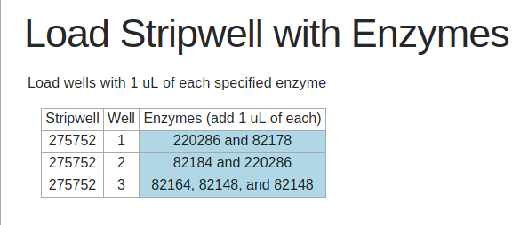
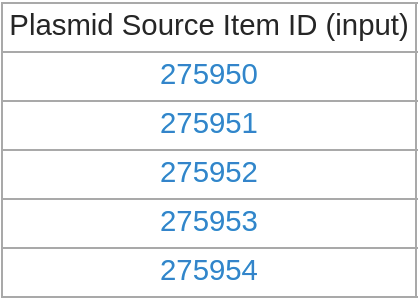
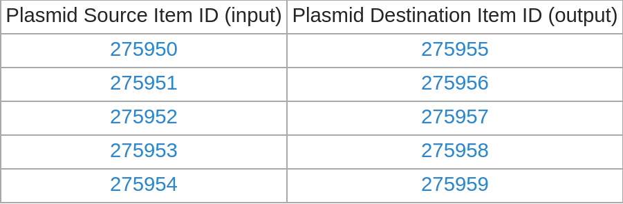
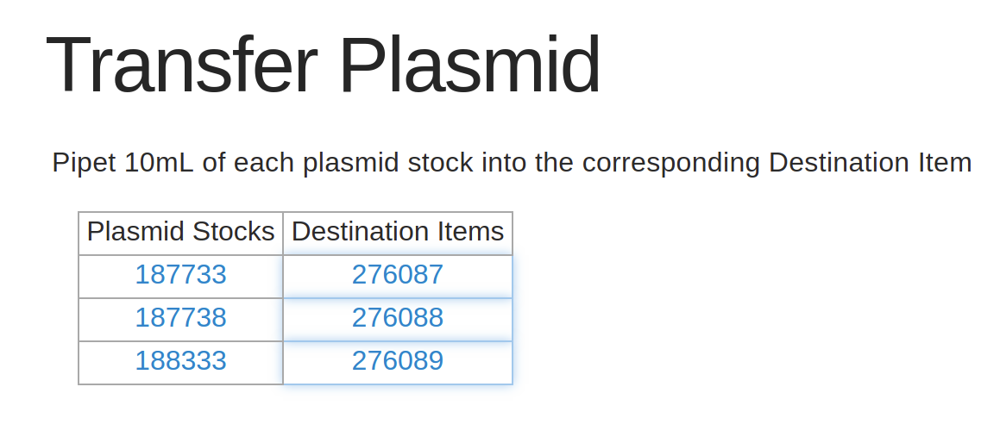

# Table Documentation

This is the documentation for generating and showing formatted `Tables`, for use in writing effective Aquarium protocols.

This page will give examples and instructions on how to get started using `Tables`, but it is not a comprehensive reference for all `Table` related methods. 
See the [API documentation](../../../api/index.html) for more details on the functions that Krill provides.

If you haven't already, visit the [protocol developer documentation](../protocol_developer) for information about getting started.

---

## Table of Contents

<!-- TOC -->

- [Table Documentation](#table-documentation)
    - [Table of Contents](#table-of-contents)
    - [Tables for Showcasing Data](#tables-for-showcasing-data)
    - [Tables on OperationList](#tables-on-operationlist)
        - [Mapping Operations to Respective Inputs or Outputs](#mapping-operations-to-respective-inputs-or-outputs)
        - [Mapping Operations to Arbitrary Atributes](#mapping-operations-to-arbitrary-atributes)
        - [Accepting Technician Input through Tables](#accepting-technician-input-through-tables)
    - [Standalone Tables](#standalone-tables)

<!-- /TOC -->

## Tables for Showcasing Data

Often in a protocol it is useful to show a summarizing visualization of a lot of data at once. In Krill, `Tables` are an easy to use object that can accomplish this. Here is an example of a `Table` as seen from the technician view during a restriction digest protocol, which instructs the technician to add the appropriate enzymes to the correct well of the correct stripwell. A table is particularly useful here, where each operation can be parameterized with a different set of enzymes. Here is an example of a `Table` shown to the technician.

Example from `Cloning/Restriction Digest`



Inside a `show` block, a `Table` like this is displayed to the technician with the `table` flag -- `table` is a flag just like `note`, `warning` and `image` which is interpreted by the `show` block to display the argument passed with it in a certain way. While `note` accepts a `String` argument and `image` expects a path to an image, the `table` flag accepts a `Table` object. Supposing that we already have a complete `Table` object stored in the variable `enzyme_tab`, showing it to the technician is simple

```ruby
    show do
        title "Load Stripwell with Enzymes"
        note "Load wells with #{VOL_OF_ENZYME} uL of each specified enzyme"
        
        table enzyme_tab
    end
```

The rest of this documentation will be focused on how to generate these table objects.

## Tables on OperationList

Aquarium protocols are designed to work on arbitrarily large batches of `Operations` at once, so it is often the case that you will want to design a `Table` where some information about each operation is represented by a row of the table. The `Table` shown in the example picture above uses this paradigm.

`OperationList` has many instance methods which make generating row-per-`Operation` style `Tables` a simpler process. Creating a `Table` from an `OperationsList` relies on _method chaining_ these instance methods. To begin the table generation process, `start_table` is called on an `OperationsList`, returing a intermediary Table-like object which is initially has one row for every `Operation` in the list, and zero columns. Further methods may be called on this intermediary object to add columns to the `Table`. When all desired columns have neen added, `end_table` is called to finish the method chain and return a usable `Table` object which is ready to show to the technician.

To create a `Table` with one column, called `simple_tab`,
```ruby
    simple_tab = operations.start_table.input_item("Plasmid Source").end_table
```

When `simple_tab` is correctly displayed within a show block, the technician might see something like this (in a `Job` of 5 `Operations`)



Notice that there is one row per operation, with a single column, headed 'Plasmid Source Item ID (input)' which was generated by the `input_item` call. Let's go into more detail on this `input_item` method, and other tabling methods which append columns to an `OperationsList` `Table`. 

### Mapping Operations to Respective Inputs or Outputs

A commonly used type of Table in protocols is one that shows a a column of input `Items` alongside a column of output `Items` -- for example, you might need to have a table like this if your protocol will instruct technicians to pipet an input plasmid stock into a specific output tube for each `Operation`. 

The `input_item` tabling method requires one argument: the name of an input. It appends a column to a table, where the contents of the new table cells in that column are the corresponding input `Item id` for the `Operation` of that row and the given input name. Our `simple_tab` example above already uses this functionality to create its single column listing the `Item ids` of the input Plasmid Stocks for each `Operation`. 
We can achieve the same functionality with outputs, by using the `output_item` method.  

Suppose that we wanted to create `simple_tab` with an additional column that shows the `Item id` for an output tube that we want to pipet our input plasmids into alongside the `Item id` of the input Plasmid stocks we will be pipetting from. An additional method is added to the chain to generate an additional column

```ruby
    simple_tab = operations.start_table.input_item("Plasmid Source").output_column("Plasmid Destination").end_table
```

Our `simple_tab` now could be very helpful for directing a technician to pipet from one item to another



The headings for the columns of this `Table` have been automatically generated using the name of the input or output, but we can add an additional optional argument to `input_item` and `output_item` for specifying a custom column headings

```ruby
    simple_tab = operations.start_table.input_item("Plasmid Source", heading: "Plasmid Stocks").output_item("Plasmid Destination", heading: "Destination Items").end_table
```

There is another optional argument which allows `Table` cells to be designated as checkable boxes, which the technician has to click on all of before moving onto the next slide. This is helpful for keeping track of which transfers have already been completed and which are still needed. We will set the output boxes as checkable

```ruby
    simple_tab = operations.start_table.input_item("Plasmid Source", heading: "Plasmid Stocks").output_item("Plasmid Destination", heading: "Destination Items", checkable: true).end_table
```

Such a nice table of course deserves an equally polished `show` block

```ruby
    show do 
      title "Transfer Plasmid"
      note "Pipet 10mL of each plasmid stock into the corresponding Destination Item"
      table simple_tab
    end
```

Now, our completed transfer instruction `show` slide run with 3 operations looks like this:



Note the blue highlight around the destination item cells -- this indicates that the cells are checkable boxes. Once clicked, the cells turn solid blue.

Two more tabling methods to be aware of are `input_collection` and `output_collection`. These methods work exactly like `input_item` and `output_collection`, except they are intended for use when the input or ouput of the `Operation` is a `Collection`. 

### Mapping Operations to Arbitrary Atributes

TODO [custom_column]

### Accepting Technician Input through Tables

[custom_input, validate, validation_message]

## Standalone Tables
TODO [Table.new, custom column, custom input, simple 2darray tables]

