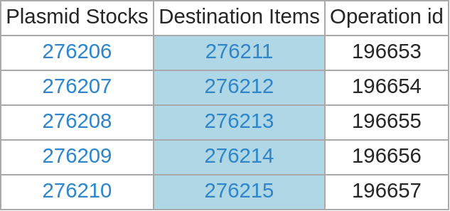
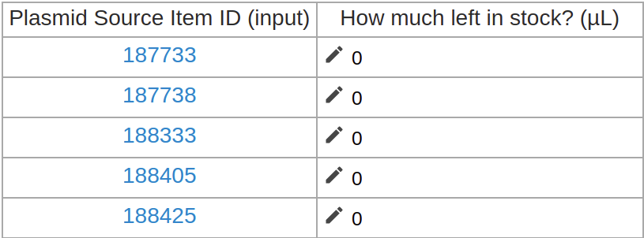
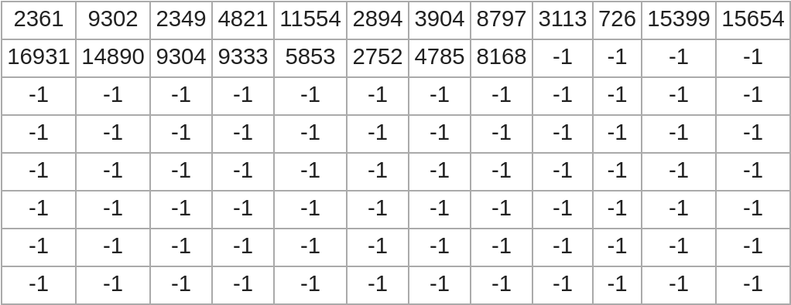

# Table Documentation

This is the documentation for generating and showing formatted `Tables`, for use in writing effective Aquarium protocols.

This page will give examples and instructions on how to get started using `Tables`, but it is not a comprehensive reference for all `Table` related methods. 
See the [API documentation](../../../api/index.html) for more details on the functions that Krill provides.

If you haven't already, visit the [protocol developer documentation](../protocol_developer) for information about getting started.

---

## Table of Contents

<!-- TOC -->

- [Table Documentation](#table-documentation)
    - [Table of Contents](#table-of-contents)
    - [Tables for Showcasing Data](#tables-for-showcasing-data)
    - [Tables on OperationList](#tables-on-operationlist)
        - [Mapping Operations to Respective Inputs or Outputs](#mapping-operations-to-respective-inputs-or-outputs)
        - [Mapping Operations to Arbitrary Atributes](#mapping-operations-to-arbitrary-atributes)
        - [Accepting Technician Input through Tables](#accepting-technician-input-through-tables)
    - [Standalone Tables](#standalone-tables)

<!-- /TOC -->

## Tables for Showcasing Data

Often in a protocol it is useful to show a summarizing visualization of a lot of data at once. In Krill, `Tables` are an easy to use object that can accomplish this. Here is an example of a `Table` as seen from the technician view during a restriction digest protocol, which instructs the technician to add the appropriate enzymes to the correct well of the correct stripwell. A table is particularly useful here, where each operation can be parameterized with a different set of enzymes. Here is an example of a `Table` shown to the technician.

Example from `Cloning/Restriction Digest`


Inside a `show` block, a `Table` like this is displayed to the technician with the `table` flag -- `table` is a flag just like `note`, `warning` and `image` which is interpreted by the `show` block to display the argument passed with it in a certain way. While `note` accepts a `String` argument and `image` expects a path to an image, the `table` flag accepts a `Table` object. Supposing that we already have a complete `Table` object stored in the variable `enzyme_tab`, showing it to the technician is simple

```ruby
    show do
        title "Load Stripwell with Enzymes"
        note "Load wells with #{VOL_OF_ENZYME} uL of each specified enzyme"
        
        table enzyme_tab
    end
```

The rest of this documentation will be focused on how to generate these table objects.

## Tables on OperationList

Aquarium protocols are designed to work on arbitrarily large batches of `Operations` at once, so it is often the case that you will want to design a `Table` where some information about each operation is represented by a row of the table. The `Table` shown in the example picture above uses this paradigm.

`OperationList` has many instance methods which make generating row-per-`Operation` style `Tables` a simpler process. Creating a `Table` from an `OperationsList` relies on _method chaining_ these instance methods. To begin the table generation process, `start_table` is called on an `OperationsList`, returing a intermediary Table-like object which is initially has one row for every `Operation` in the list, and zero columns. Further methods may be called on this intermediary object to add columns to the `Table`. When all desired columns have neen added, `end_table` is called to finish the method chain and return a usable `Table` object which is ready to show to the technician.

To create a `Table` with one column, called `simple_tab`,
```ruby
    simple_tab = operations.start_table.input_item("Plasmid Source").end_table
```

When `simple_tab` is correctly displayed within a show block, the technician might see something like this (in a `Job` of 5 `Operations`)


Notice that there is one row per operation, with a single column, headed 'Plasmid Source Item ID (input)' which was generated by the `input_item` call. Let's go into more detail on this `input_item` method, and other tabling methods which append columns to an `OperationsList` `Table`. 

### Mapping Operations to Respective Inputs or Outputs

A commonly used type of Table in protocols is one that shows a a column of input `Items` alongside a column of output `Items` -- for example, you might need to have a table like this if your protocol will instruct technicians to pipet an input plasmid stock into a specific output tube for each `Operation`. 

The `input_item` tabling method requires one argument: the name of an input. It appends a column to a table, where the contents of the new table cells in that column are the corresponding input `Item id` for the `Operation` of that row and the given input name. Our `simple_tab` example above already uses this functionality to create its single column listing the `Item ids` of the input Plasmid Stocks for each `Operation`. 
We can achieve the same functionality with outputs, by using the `output_item` method.  

Suppose that we wanted to create `simple_tab` with an additional column that shows the `Item id` for an output tube that we want to pipet our input plasmids into alongside the `Item id` of the input Plasmid stocks we will be pipetting from. An additional method is added to the chain to generate an additional column

```ruby
simple_tab = operations.start_table.input_item("Plasmid Source").output_column("Plasmid Destination").end_table
```

Our `simple_tab` now could be very helpful for directing a technician to pipet from one item to another


The headings for the columns of this `Table` have been automatically generated using the name of the input or output, but we can add an additional optional argument to `input_item` and `output_item` for specifying a custom column headings

```ruby
simple_tab = operations.start_table.input_item("Plasmid Source", heading: "Plasmid Stocks").output_item("Plasmid Destination", heading: "Destination Items").end_table
```

There is another optional argument which allows `Table` cells to be designated as checkable boxes, which the technician has to click on all of before moving onto the next slide. This is helpful for keeping track of which transfers have already been completed and which are still needed. We will set the output boxes as checkable

```ruby
simple_tab = operations.start_table.input_item("Plasmid Source", heading: "Plasmid Stocks").output_item("Plasmid Destination", heading: "Destination Items", checkable: true).end_table
```

This method chain is getting fairly long, it may be more readable if we put newlines between the method calls

```ruby
simple_tab = operations.start_table
                    .input_item("Plasmid Source", heading: "Plasmid Stocks")
                    .output_item("Plasmid Destination", heading: "Destination Items", checkable: true)
                    .end_table
```

Such a nice table of course deserves an equally polished `show` block

```ruby
show do 
    title "Transfer Plasmid"
    note "Pipet 10µL of each plasmid stock into the corresponding Destination Item"
    table simple_tab
end
```

Now, our completed transfer instruction `show` slide run with 3 operations looks like this:


Note the blue highlight around the destination item cells -- this indicates that the cells are checkable. Once clicked, the checkable cells turn solid blue.

Two other important tabling methods are `input_collection` and `output_collection`. These methods work exactly like `input_item` and `output_item`, except they are intended for use when the input or ouput of the `Operation` is a `Collection`. 

### Mapping Operations to Arbitrary Attributes

`input_item` and `output_item` are convienent for displaying the inputs and outputs of each `Operation` in an `OperationsList`, but what if we want to display other information about an `Operation` besides the `Item ids` of its inputs and outputs?

`custom_column` is a valuable method that we can call as part of the table generation method chain from an `OperationsList`. Like `input_item`, `custom_column` will add a column to the table, and the contents of each cell of this new column will be a function of the `Operation` that is associated to the row of the table the cell appears.

While `input_item` maps each `Operation` to the `Item id` of a specified input, `custom_column` allows you to define the attribute that each `Operation` will be mapped to. `custom_column` does not automatically generate a useful heading, and so requires the `heading:` option to be defined. It also requires a code block to determine what attribute of the `Operations` will be mapped to. 

To start off with a simple example, imagine that for some reason you would like to add a column to `simple_tab` which lists the `Operation id` that the transfer for that row is associated with. We could do that with a `custom_column` that displays `op.id` for each `op` in `operations`

```ruby
simple_tab = operations.start_table
                    .input_item("Plasmid Source", heading: "Plasmid Stocks")
                    .output_item("Plasmid Destination", heading: "Destination Items", checkable: true)
                    .custom_column(heading: "Operation id") { |op| op.id }
                    .end_table
```

Here is the result of such a table



(Note that this time the checkable cells have already all been clicked)

A more exciting example might be to make a `custom_column` that lists a calculated volume of plasmid to transfer that is distinct between `Operations`, rather than just instructing to transfer 10µL for every `Operation` as we had written before. A clean way to accomplish this is by first storing the calculated value in the `temporary` hash of each `Operation`, and then mapping the each Operation to that value from the `custom_column`. For more on how the `temporary` hash works, see the [Operation Method Documentation](TODO).

In this somewhat contrived example, we calculate the volume of plasmid to transfer by dividing the length of the input Plasmid by 500.

```ruby
# calculating volume to transfer
operations.each do |op|
    plasmid_length = op.input("Plasmid Source").sample.properties[length].to_f
    op.temporary[:transfer_volume] = plasmid_length / 500
end

# creating table
simple_tab = operations.start_table
                    .input_item("Plasmid Source", heading: "Plasmid Stocks")
                    .output_item("Plasmid Destination", heading: "Destination Items", checkable: true)
                    .custom_column(heading: "Amount to transfer (µL)") { |op| op.temporary[:transfer_volume] }
                    .end_table

# showing table
show do 
    title "Transfer Plasmid"
    table simple_tab
end
```

This general `Table` form is quite effective. It is commonly used in many Aquarium protocols


### Accepting Technician Input through Tables

`Tables` can also be used to ask technicians for data input, using the `custom_input` tabling method. `custom_input` works similarly to `custom_column`, taking a heading option, and a code block evaluated on every Operation in the OperationsList which fills in the cell with a default value. `custom_input` also takes a 2 new arguments. `key` is the first parameter of `custom_input`, it is required and used when storing the inputted data. Any inputted data by the technician into the cells of a `custom_input` column will be stored in the `temporary` hash of the `Operation` corresponding to the row of the table it was inputted on, and the `key` parameter determines the key of the `temporary` hash for that `Operation` which the new data will be stored under. `:type` is a option for `custom_input` which specifies what data type to accept as input. It is not a required option, and `custom_input` cells will default to accepting Strings.

As an example, lets create an data input `Table` which asks the technician to measure and record the remaining volume of a plasmid stock

```ruby
record_volume_tab = operations.start_table
                        .input_item("Plasmid Source")
                        .custom_input(:plasmid_volume, type: "number", heading: "How much left in stock? (µL)") { |op| 0 }
                        .end_table
```

The pencil symbol next to Table cells indicates to the technician that input is required.



To use this inputted data in the rest of the protocol, we must access the temporary hash of the operations. The following code uses the inputted data to generate a `Table` that parrots back whatever data had just entered in the `record_volume_tab`

```ruby
volume_tab = operations.start_table
                        .input_item("Plasmid Source")
                        .custom_column(heading: "Remaining Volume (µL)") { |op| op.temporary[:plasmid_volume] }
                        .end_table
```

Since we didn't change the default value for any of the rows, all of the entered volumes should be 0

TODO [volume_tab picture] 

When accepting any technician input, it can be useful to validate the input and make sure it is of an expected form. Most likely the workers of your own lab will not attempt to do a SQL injection attack from within a protocol, but ensuring the input is valid before storing it or using it for calculations can resolve many potential errors caused by technician typos.

See the [API documentation on `validate` and `validation_message` tabling methods](../../../api/Krill/OperationList.html#validate-instance_method) for information on how to validate inputted data in a `Table`.

## Standalone Tables

We have discussed so far how to build `Tables` where the rows correspond to the `Operations` of a protocol, but it is also possible to make tables that do not depend on an `OperationsList`.

`Table.new` will return a `Table` object that we can then chain method calls onto it to add columns in a similar way to how we did with the `OperationsList` `Tables`. `add_column` does exactly this -- it takes a String header as the first parameter, and an array of cell content for the second parameter. 

For instance, suppose we had a palindromic sequence of DNA in an array that we would like to display to the technician in a table with a two columns, one with the forward direction and one with the reverse. First we make the arrays

```ruby
three_to_five = ["G","G","A","T","C","C"]
five_to_three = three_to_five.reverse
```

We use `Table.new`, and `add_column` to construct the `Table`

```ruby
standalone_tab = Table.new.add_column("3 to 5", three_to_five).add_column("5 to 3", five_to_three)
```

Notice that we do not have to call end_table to return a complete `Table` object for simpler standalone `Tables`. standalone_tab can be now placed in a show block as is

```ruby
show do
    title "Important Sequence"
    table standalone_tab
end
```

The resulting table:


There is another, perhaps simpler way to make standalone `Tables` in protocols, which relies on a special aspect of the `table` show block flag. As mentioned before, `table` will accept a `Table` object to display, but not yet mentioned is that it can also accept an ordinary 2d array to a display as a `Table`.

With this in mind, we could display a similar table as above (without the headers) by just doing

```ruby
show do
    title "Important Sequence"
    table [three_to_five, five_to_three]
end
```

Tabling on 2d arrays allows us a convienent way to display data about the `Parts` of a `Collection` to the technician, since much of the data associated with a `Collection` is stored as a 2d array. For example, supposing that one of the inputs for a protocol is called '96 Well' and accepts a `Collection`, we could display the `sample_matrix` of the `Collection` for each `Operation` using a `show` blocks like so

```ruby
operations.each do |op|
    show do
        title "Collection Samples - #{op.input("96 Well").collection.id}"
        table op.input("96 Well").collection.matrix
    end
end
```

This would produce several `show` slides -- one for each `Operation` in the `Job` -- where each slide displays the 
`Sample ids` of the contents of the '96 Well' input `Collection` for that `Operation`. Here is such a displayed `Collection`, where only the first 20 `Parts` of the `Collection` are filled with `Samples`. Empty slots are designated by `-1` 


