# Protocol Tutorial

This is an introduction to writing protocols for Aquarium in the Krill domain specific langauge.
We try to introduce the most common (and recommended) patterns in Krill, but this is not a comprehensive reference.
See the [API documentation](../api/index.html) for more details on the functions that Krill provides.

If you haven't already, visit the [protocol development documentation](index.md) for information about getting started.

---

## Table of Contents

<!-- TOC -->

- [Protocol Tutorial](#protocol-tutorial)
    - [Table of Contents](#table-of-contents)
    - [The Basic Protocol](#the-basic-protocol)
    - [Running a Protocol](#running-a-protocol)
        - [Creating a Protocol](#creating-a-protocol)
        - [Running a Protocol from the Developer Test Tab](#running-a-protocol-from-the-developer-test-tab)
        - [Running a Deployed Protocol](#running-a-deployed-protocol)
    - [Creating Technician Instructions](#creating-technician-instructions)
    - [Working with Samples](#working-with-samples)
        - [Practicing Queries](#practicing-queries)
        - [Common definitions and record identifiers](#common-definitions-and-record-identifiers)
        - [Provisioning Items](#provisioning-items)
        - [Creating Items and Samples](#creating-items-and-samples)
        - [Creating Collections](#creating-collections)
        - [Sample](#sample)
            - [Attributes](#attributes)
            - [Associations](#associations)
        - [Object Type (a.k.a. Container)](#object-type-aka-container)
            - [Attributes](#attributes-1)
        - [Item](#item)
            - [Attributes](#attributes-2)
            - [Associations](#associations-1)
            - [Instance methods](#instance-methods)
        - [Collection](#collection)
            - [Additional associations](#additional-associations)
            - [Additional instance methods](#additional-instance-methods)
    - [Managing Operations](#managing-operations)
    - [Protocol Patterns](#protocol-patterns)
        - [Protocols that Create New Items](#protocols-that-create-new-items)
        - [Protocols that Measure Items](#protocols-that-measure-items)
        - [Protocols that Modify Items](#protocols-that-modify-items)
    - [Building Libraries](#building-libraries)

<!-- /TOC -->

## The Basic Protocol

A protocol is a Ruby class named `Protocol` with a `main` method that includes code that defines what happens in the protocol.
A simple example is

```ruby
class Protocol
  def main
    show { title "Getting Started" }
  end
end
```

where the body of `main` displays a single page titled "Getting Started".
When the protocol is started, Aquarium extends the Protocol class with the Krill methods described below.

## Running a Protocol

You'll probably want to follow along with the examples as you go through this tutorial.
To do this, decide on a category name for your operation types.
For our example, we use `tutorial_adev` where "adev" is the user name.
You'll also want to decide whether you will use the same operation type to try the examples as you go, or make a new one.

And, in case the admonition hasn't yet settled in, **don't** use a production server for testing.

### Creating a Protocol

1.  Starting from the developer tab, click the **New** button in the upper right corner.

    

    This will create a new operation type in the current category.

    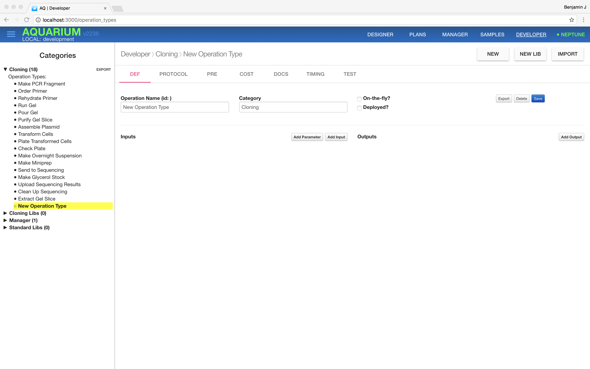

2.  Change the operation type name and category and click the **Save** button.

    

    For this example, we use the name `BasicProtocol` and category `tutorial_adev` ("adev" is the login name).

3.  Click **Protocol**, replace the body of the main method with the code `show { title "Getting Started" }` like in our example, and click the **Save** button at the bottom right.

    

### Running a Protocol from the Developer Test Tab

The simplest way to run a protocol is by using testing in the Developer Tab.

1.  Click **Test**

    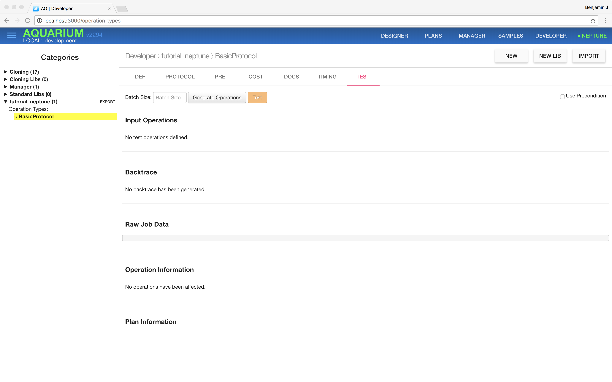

2.  Click the **Generate Operations** button to generate instances of the operation type with random inputs

    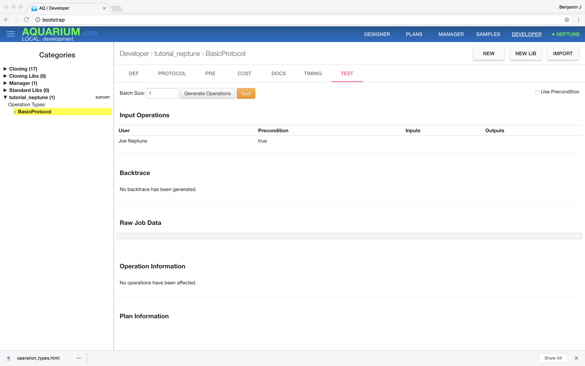

3.  Click the **Test** button to run the operation(s) with the inputs and show the trace with any output

    

In this case, we see the page title "Getting Started" as output.

### Running a Deployed Protocol

You can run the protocol so that it will show you the screens as the technician will see them, but this is more involved.

1.  In the Developer **Def** view, click the **Deployed** checkbox

    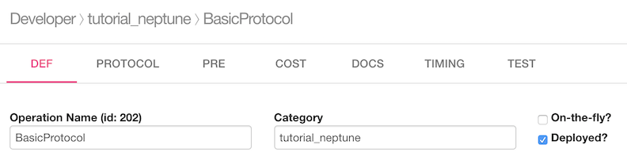

2.  Click the _Designer_ tab at the top of the page, click _Design_, and then choose your category under _Operation Types_

    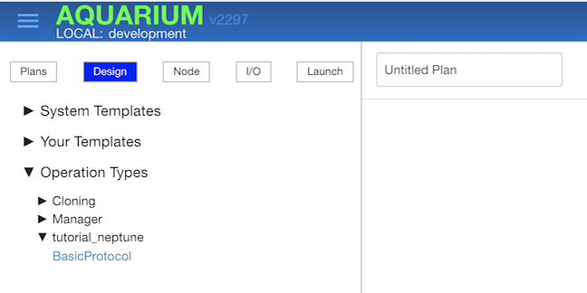

3.  Click the operation type name `BasicProtocol` to add the operation to the plan

    

4.  Save the plan, and then click **Launch**. You'll have to select and confirm your budget, and click _Submit_

    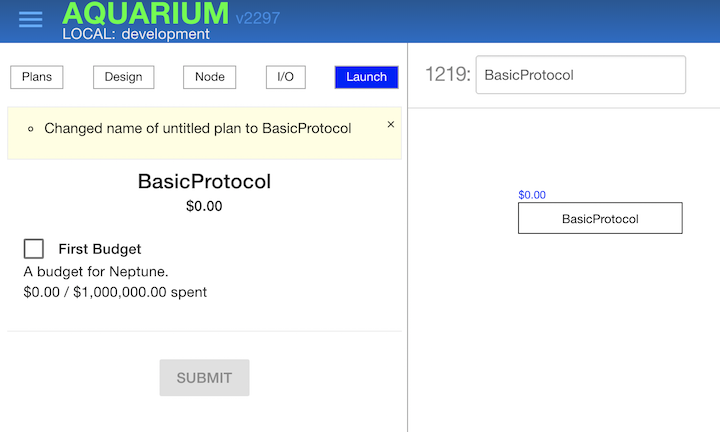

5.  Select the **Manager** tab, and click your category in the list on the left.

    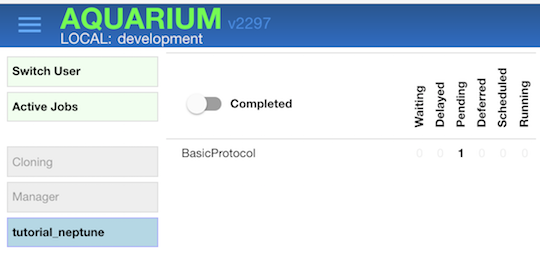

6.  Click the pending job for `BasicProtocol`, click the _All_ button and click _Schedule_

    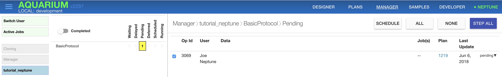

7.  Click the pending ID under **Jobs**

    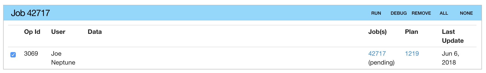

8.  Click _Start_

    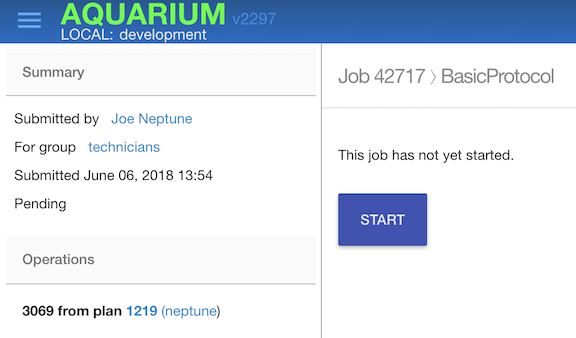

9.  Use the buttons in the Technician view to move through the protocol.

    

    Ordinarily, clicking **OK** will move to the next slide, but since there is only one there, the protocol will end.

This process is involved, but under normal operation, there are at least three people involved in these steps: the plan designer, a manager, and a technician.

## Creating Technician Instructions

The primary goal of a protocol is to display the instructions that technicians follow.
Each screen is created by a `show`-block that indicates what is to be displayed.
For instance, the following show block provides instructions to clean up after using a scale in a protocol:

```ruby
show do
  title "Clean up"

  note "Discard all weighing paper, weighing boats and plastic spatulas into the non-biohazard waste"
  note "Wash spatulas with tap water. Dry and return to beaker next to scale"
  note "Use a damp kimwipe to wipe scale till there is no solid powder left anywhere on it"
end
```

The words `title` and `note` are functions that determine the appearance of the text on the constructed page.
This example renders as

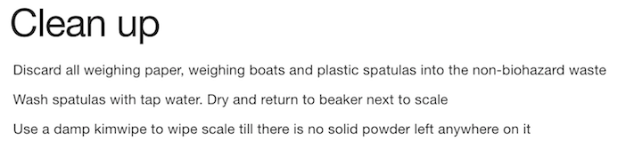

We could also use `bullet` here instead of `note` for the list of tasks.
However, we want to have the techinician confirm each step, and so use `check` instead:

```ruby
show do
  title "Clean up"

  check "Discard all weighing paper, weighing boats and plastic spatulas into the non-biohazard waste"
  check "Wash spatulas with tap water. Dry and return to beaker next to scale"
  check "Use a damp kimwipe to wipe scale till there is no solid powder left anywhere on it"
end
```

which gives the output


where the technicians must tap each checkbox before they can move to the next page.

There are several other style functions that can be used in a `show`-block that are covered later.

## Working with Samples


In Aquarium, protocols work with an `Item` that is a unique instance of a sample in a container. Each sample is represented by a `Sample` object, and containers by an `ObjectType` object. The item is the physical object that is manipulated.

As an example, a pMOD8 plasmid streaked out onto a plate sitting on a lab bench would be represented as an `Item`, where the `Sample` is ‘pMOD8,’ the `ObjectType` is ‘E. coli Plate of Plasmid,’ and the location is ‘Lab Bench.’ The `SampleType` is ‘Plasmid.’

These objects are managed in the Aquarium inventory, so to access them, you need to make queries.

To find the sample for pMOD8, you can make the query

```ruby
Sample.find_by_name('pMOD8')
```

Once you have an object, you can use the record identifier of the object in other queries.

Continuing our example, we can look for all `Items` with sample pMOD8 and container 'E. coli Plate of Plasmid' (i.e., the pMOD8 has been plated) located on the bench using the following query: 

```ruby
plate = Item.where(
  sample_id: Sample.find_by_name('pMOD8').id,
  object_type_id: ObjectType.find_by_name('E. coli Plate of Plasmid').id
  location: 'Bench'
  )
```

which returns a list of one `Item` object. To access it, you would say plate.first (.where always returns list for the sake of consistency, even if there’s only one object within the database that matches your query) . 

Let’s say you’re interested in performing an _E. coli_ transformation. This means you also need Competent Cell aliquots. Those are located in the -80C freezer and are grouped into a batch, or collection.

You can think of a collection as an item that has separate parts. Using the example of DH5alpha comp cells: The entire batch is represented under one item ID — say, 67890 — but that item has n number of parts, one for each aliquot. In Aquarium, collections are represented using a matrix, or 2D array. 

Why are DH5alpha comp cells represented as a batch rather than single, distinct items like a tube of plasmid? To make the decision about whether you should represent an aliquot as a batch or a distinct item, a good rule of thumb is asking yourself: Do I care which specific, physical aliquot (or plate, overnight, etc.) I use of this sample? 

If the answer is yes — e.g., you have ten tubes of the sample pMOD8, but you want the one that has a concentration of 250 ng/uL — you should probably use an item to represent it. If the answer is no — e.g., you make a batch of seventy DH5alpha competent cell aliquots and don’t care which one you pull out of the freezer any time you want to use one — you should probably use a collection to represent it. 

Suppose you make this query: 

```ruby
batch = Item.where(
  sample_id: Sample.find_by_name('DH5alpha').id,
  location: "M80C.2.0.21"
  ).first
```

This returns a single item with object type `"E. coli Comp Cell Batch"` (since, after the .where() method, there’s a .first, which returns the first item in the list). 

If the object type of an item has handler 'collection' (NOTE: has ‘handler’ been defined?), it will be useful to have access to the collection methods.

To promote the item `batch` to a collection, use

```ruby
c = collection_from batch
```

And likewise, for a list of items, `items`: 

```ruby
colls = items.map { |i| collection_from i }
```

### Practicing Queries

You can use the Rails console for Aquarium to try queries like this: At the command line, start the rails console with `rails c` and use it interactively to evaluate queries.

The allowable queries are standard with Ruby on Rails `ActiveRecord` models.

In depth documentation on how to use the activerecord query interface can be found [here](http://guides.rubyonrails.org/v3.2.21/active_record_querying.html).

The Rails console is extremely useful when you’re either trying to write a protocol or debugging a protocol. 

### Common definitions and record identifiers

It is tempting to use constant values to search with record identifiers, but these identifiers are determined by how the database is built and could change.

So, use the sample names instead; however, the catch is that the names you should use are also determined by the inventory of your Aquarium instance.

**TODO: explain how to get common definition and/or to manage objects**


### Working With Items in Operations

Each instance of a protocol is contained within an operation. An operation is created by the user in the Aquarium planner and then batched together by the lab manager in the Aquarium manager into a job, which is then performed by the technician. 

`Operations` also have an `OperationType`. As an example: Suppose you have created an `OperationType` with the name “E. coli Transformation.” You’ve written all the code you need, and now you’re read to run it. An `Operation` would be a specific instance of “E. coli Transformation” (the `OperationType`), and a job would be a batch of operations that have been submitted and need to be run. 

There are two ways to retrieve items within a protocol, and the two methods are called `retrieve` and `take`. Both of them instruct the technician to retrieve items.

`retrieve` is used on what’s called an `OperationList`, which is exactly what it sounds like — a list of operations being used in a specific job. To access all the operations, we use `operations`. `retrieve` is used to retrieve all of the input items associated with an operation. 

To instigate a “retrieve,” you would write the following code:  

```ruby
class Protocol
  def main 
    operations.retrieve
    …
  end
end
```

`take`, on the other hand, takes an argument that’s an array of items, which makes it ideal for retrieving items that aren’t included as explicit inputs in the definition of an operation — e.g., master mix for a PCR, which isn’t something the user should need to explicitly select. 

To instigate a retrieve, you would write something like the following code: 

```ruby
class Protocol
  def main 
    sample = Sample.find_by_name(“pMOD8”)
    items_to_retrieve = Item.where(sample_id: sample.id)
    take items_to_retrieve
    …
  end
end
```

This code first finds the sample “pMOD”, and then finds all the items that are associated with that sample. The technician is then instructed to retrieve all of them. 

Another important thing both `retrieve` and `take` do is “touch” the item, which allows us to keep a record of all the items used in a job. This is extremely useful for troubleshooting. 

To put items away, you can use `release` (which is used in conjunction with `take` and takes the same arguments) and/or `operations.store` (which is used in conjunction with `operations.retrieve`).

### Writing a Protocol

To use a semi-realistic example, let’s write a simple version of the “E. coli Transformation” protocol from above. I won’t be going in-depth about all the methods being used, but I’ll leave categorizing each method (through the help of the [Aquarium docs] (http://52.27.43.242/doc/index.html) and detailed [method reference] (http://klavinslab.org/aquarium-api/) as an exercise for the reader. 

Before writing a protocol, it’s always important to ask questions about how you want to structure it, such as: 

- Who’s going to be using it?
- Will it be “batched” together with other protocols? (The answer to this one is usually ‘yes.’)
- What input/output structures do I want to use? Items, Collections, an array of items, etc.
	* To figure this one out, it’s best to first ask yourself, “What are the pros/cons of doing it a specific way? Which operation types will be wired into this, which operation types will  be successors?” A protocol is rarely intended to be used as a standalone — it’s almost always a part of a larger workflow, so it’s important to figure out how you’re going to structure the entire workflow instead of going in all gung-ho, guns a blazin’.  


Once you’ve figured out how you’re going to structure it, outlining the protocol is useful. An outline for the Transform E. Coli protocol is something like the following: 
- Check if there are enough comp cells to perform the protocol
- Instruct technician to retrieve cold items needed for transformation
- Label the comp cells
- Electroporate and rescue
- Incubate transformants
- Put away items 

First, define what the inputs and outputs are going to be. This is a transformation protocol — the inputs are going to be comp cells and a plasmid. Comp cells are best represented as a batch, a plasmid as an item. The output is going to be a transformed _E. coli_ aliquot — also a plasmid. So:


The “Plasmid” input represents the plasmid — I recommend you take a moment to get over that shocking revelation because there’s something even _more_ shocking coming: The “Comp Cells” input represents the comp cells. 

“Plasmid” has multiple sample type / container combinations, because a plasmid can be held in many different containers and you want to give the user as much flexibility as possible. “Comp Cell” only has one sample type / container combination because you only want to use _E. coli_ comp cells, which are all held in the same type of container — a batch. 


The output is “Transformed E Coli” with container “Transformed E. coli Aliquot,” which will be plated after some incubation period. 

This is the first section of the code, going through and trying to figure out whether or not there are enough comp cells for the operation: 

```ruby
class Protocol
  def main 
    operations.each do |op|
      # If current batch is empty
      if op.input(“Comp Cells”).collection.empty?
        old_batch = op.input(“Comp Cells”).collection
               
        # Find replacement batches
        all_batches = Collection.where(object_type_id: op.input(“Comp Cells”).object_type.id).keep_if { |b| !	b.empty? }
        batches_of_cells = all_batches.select { |b| b.include? op.input(“Comp Cells”).sample && ! b.deleted? }.sort { |x| x.num_samples }
        batches_of_cells.reject! { |b| b == old_batch } # debug specific rejection to force replacement
```
This looks like a lot, so let’s break it down. 

To understand what’s happening here, the first thing you have to do is understand how a `Collection` is represented in Aquarium. 

A `Collection` is represented as a matrix, and looks like the following: 


Each part of the collection is filled with a “7,” which is the sample ID for DH5alpha. In the database, it’s stored like this: [[7,7,7,7,7,7,7,7,7]…[-1,-1,-1,-1,-1,-1,-1,-1,-1,-1]], where “-1” indicates an empty slot. 

Because a `Collection` is represented thusly, numerous array methods are used to sort through all collections in Aquarium and find the ones that we’re interested in, which is what all that code above is doing. 

 ```ruby              
        # Error if not enough
        if batches_of_cells.empty?
        op.error :not_enough_comp_cells, "There were not enough comp cells of  #{op.input(“Comp 	Cells”).sample.name} to complete the operation."
        else
```
This lets the user know there weren’t enough comp cells of the correct strain (through ‘op.input(“Comp Cells”).sample.name’, which retrieves the sample name of that input) and errors the operation out. 

```ruby
        # Set input to new batch
          op.input(“Comp Cells”).set collection: batches_of_cells.last
                    
          # Display warning
          op.associate :comp_cell_batch_replaced, "There were not enough comp cells for this operation.            	Replaced batch #{old_batch.id} with batch #{op.input(CELLS).collection.id}"
        end
      end
  end 
```

This code sets a new comp cell batch as the “input” (through op.inputs(“Comp Cells”).set) if there are other batches available and lets the user know know through a data association (`op.associate`, which takes in two arguments: The key and upload; here, “comp cell batch replaced” and the message letting the user know a new comp cell was used, respectively).

Data associations are a great tool to pass information through Aquarium. You can upload messages, measurements, pictures, files, passive-aggressive notes — it’s all good. Operations, samples, items, etc. all have data associations, which means it’s very easy to attach and retrieve information from all of these. For a more detailed breakdown, click [here] (http://52.27.43.242/doc/md-viewer?doc=DataAssociation)

You also want to detract the comp cell aliquots used from the batch, so the online inventory is accurate. To do so, there’s a `remove_one` method included in a library, which is used like so: 

```ruby
  operations.running.each { |op| op.input(“Comp Cells”).collection.remove_one op.input(“Comp Cells”).sample }
```

```ruby
    # Prepare electroporator 
        show do
            title "Prepare bench"
            note "If the electroporator is off (no numbers displayed), turn it on using the ON/STDBY button."
            note "Set the voltage to 1250V by clicking the up and down buttons."
            note " Click the time constant button to show 0.0."
            image "Actions/Transformation/initialize_electroporator.jpg"
            
            check "Retrieve and label #{operations.running.length} 1.5 mL tubes with the following ids: #{operations.running.collect { |op| "#{op.output(“Transformed E Coli”).item.id}"}.join(",")} "
            check "Set your 3 pipettors to be 2 uL, 42 uL, and 300 uL
            check "Prepare 10 uL, 100 uL, and 1000 uL pipette tips."      
            check "Grab a Bench SOC liquid aliquot (sterile) and loosen the cap."
        end
```

This is a show block, letting the tech know to prepare the electroporator and label the tubes. `operations.running` returns a list of all the un-errored operations, and because it returns an `OperationList`, you can use the built-in ruby enumerators on it (e.g., `collect`, `join`, etc.).

Something to get used to, if you haven’t used Ruby before, is method chaining — the practice of putting multiple methods in one line, e.g., `operations.running.collect { … }.join`. This is the same thing as doing:

```ruby
  ops = operations.running
  item_ids = ops.collect { … } 
  message = item_ids.join(“,”)
  note “"Retrieve and label … with the following ids: #{message}”
```
It’s easy to see why method chaining is preferred. 

The next part is to label all the tubes: 

```ruby
# Label comp cells 
  show do 
    title "Label aliquots"
    aliquotsLabeled = 0
    operations.group_by { |op| op.input(“Comp Cells”).item }.each do |batch, grouped_ops|
      if grouped_ops.size == 1
        check "Label the electrocompetent aliquot of #{grouped_ops.first.input(“Comp Cells”).sample.name} as #{aliquotsLabeled + 1}."
      else
        check "Label each electrocompetent aliquot of #{grouped_ops.first.input(“Comp Cells”).sample.name} from #{aliquotsLabeled + 1}-#{grouped_ops.size + aliquotsLabeled}."
      end
      aliquotsLabeled += grouped_ops.size
    end
    note "If still frozen, wait till the cells have thawed to a slushy consistency."
    warning "Transformation efficiency depends on keeping electrocompetent cells ice-cold until electroporation."
    warning "Do not wait too long"
    image "Actions/Transformation/thawed_electrocompotent_cells.jpg"
  end
```

There’s a new option here — `image`, which allows you to insert an image into the show blocks. 

The reason this section of code uses `group_by` (a Ruby method) is to group all the operations by the batch ID being used. So, each batch will be separated. Suppose you have ten operations; the first five use batch 1234, the next four use batch 4567, and the last one uses 78910. This is what the “groups” would look like: 

batch 1234: operations 1, 2, 3, 4, 5 
batch 4567: operations 6, 7, 8, 9
batch 78910: operation 10

The tech would be told to label the first four comp cells from “1-5”; the `aliquotsLabelled` variable would go up by 5, so the next time the loop is run, it would tell the tech to label the next four comp cells “6-9”; once more, `aliquotsLabelled` would go up (this time by four), and, finally, the tech would be told to label the last comp cell as “10.”

Now, we need to write the instructions for the actual transformation: 

```ruby
1        index = 0 
2        show do
3            title "Add plasmid to electrocompetent aliquot, electroporate and rescue "
4            note "Repeat for each row in the table:"
5            check "Pipette 2 uL plasmid/gibson result into labeled electrocompetent aliquot, swirl the tip to mix and place back on the aluminum rack after mixing."
6           check "Transfer 42 uL of e-comp cells to electrocuvette with P100"
7           check "Slide into electroporator, press PULSE button twice, and QUICKLY add 300 uL of SOC"
8            check "pipette cells up and down 3 times, then transfer 300 uL to appropriate 1.5 mL tube with P1000"
9           table operations.running.start_table 
10                .input_item("Plasmid")
11                .custom_column(heading: "Electrocompetent Aliquot") { index = index + 1 }
12                .output_item("Transformed E Coli", checkable: true)
13                .end_table
14        end
```

This uses a new Aquarium object — `Table`. The table looks like this: 


I’m going to break down the block of code that displays this table, because the rest of the show block is pretty standard. 

The `table` (in line 9) is analogous to `note`, `check`, `warning`, etc. in that it’s used as a flag to display the following argument in a certain way. Without using `table`, your table won’t show up. 

Method chaining can be either on the same line, or on multiple lines, too. So the block of code that says: 
```ruby
operations.running.start_table
  .input_item("Plasmid")
  .custom_column(heading: "Electrocompetent Aliquot") { index = index + 1 }
  .output_item("Transformed E Coli", checkable: true)
  .end_table
```
Is the same thing as `operations.running.start_table.input_item("Plasmid").custom_column(heading: "Electrocompetent Aliquot") { index = index + 1 }.output_item("Transformed E Coli", checkable: true).end_table`, except a) that doesn’t fit on one line and b) it’s much, much more confusing. As such, for clarity’s sake, it’s split onto multiple lines. 

`start_table` is the method that starts the table. `input_item` adds a column that displays the input item associated with the input “Plasmid.” `custom_column` takes in two arguments: One for what heading should be displayed, and the other is a block that determines what will be displayed in each row of the column. In this case, it’s `index`, which is  way to number things 1–n, where n is the number of operations. 

`output_item` is exactly like `input_item`, but instead references the output. `end_table` is what signals the end of the table, and to display a table, `end_table` is necessary because that is what returns the fully-formed table. 

There are many table methods — refer to the more general [Operation documentation] (http://52.27.43.242/doc/md-viewer?doc=Operations) for an overview. 

The next step is to incubate the transformants: 

```ruby
 show do 
            title "Incubate transformants"
            check "Grab a glass flask"
            check "Place E. coli transformants inside flask laying sideways and place flask into shaking 37 C incubator."
            #Open google timer in new window
            note "<a href=\'https://www.google.com/search?q=30%20minute%20timer\' target=\'_blank\'>Use a 30 minute Google timer</a> to set a reminder to retrieve the transformants, at which point you will start the \'Plate Transformed Cells\' protocol."
            image "Actions/Transformation/37_c_shaker_incubator.jpg"
            note "While the transformants incubate, finish this protocol by completing the remaining tasks."
        end
```

This also opens up a Google timer for one hour, which is useful. 

The last step the tech needs to do is clean up, so: 
```ruby
        show do
            title "Clean up"
            check "Put all cuvettes into biohazardous waste."
            check "Discard empty electrocompetent aliquot tubes into waste bin."
            check "Return the styrofoam ice block and the aluminum tube rack."
            image "Actions/Transformation/dump_dirty_cuvettes.jpg"
        end
```
We also need to move all the output transformations to the 37C shaker, and we need to do so manually: 

```ruby
        operations.running.each do |op|
            op.output(“Transformed E Coli”).item.move "37C shaker"
        end
```

And that’s it! Not too bad. Make sure you have the correct number of `end`s, and you can start testing this protocol out on Aquarium immediately. 

TIP: While writing a protocol, if you find yourself thinking, “Gosh, I wish there were a method I could use that would do (insert tedious thing here),” chances are, there is — look through the in-depth Aquarium documentation or search for a ruby method through Google. If there _isn’t_, you can make one yourself and stick it in a library. 

### Creating Items and Samples

To make new items you use either `new_object` or `new_sample`, which both return Items.
Typically, these functions are used with the `produce` function so that the items returned are (a) put in the databased with new unique ids and (b) associated with the job (i.e. they are "taken").

* `new_object name` - This function takes the name of an object type and makes a new item with that object type.
  An object type with that name must exist in the database.
  For example, you might do the following, which would return a new item in the variable `i`.

  ```ruby
  i = produce new_object "1 L Bottle"
  ```

* `new_sample sample_name, of: sample_type_name, as: object_type_name` - This function takes a sample name and an object type name and makes a new item with that name.
  For example, you might do the following, which returns a new item in the variable `i` whose object type is "Plasmid Stock", whose corresponding sample is "pLAB1" and whose sample type is "Plasmid".

  ```ruby
  j = produce new_sample "pLAB1", of: "Plasmid", as: "Plasmid Stock"
  ```

  When a protocol is done with a an item, it should release it.
  This is done with the release function.

* **release item_list, opts={} //optional block//** -- release an item.
  This function has many forms.
  Suppose `i` and `j` are items currently ''taken'' by the protocol.

  ```ruby
  release([i,j])
  ```

  * ^ This version of release simply release the items i and j (i.e. it marks them as not taken by the job running the protocol).


  ```ruby
  release([i,j],interactive: true)
  ```

  * ^ This version calls `show` and tells the user to put the items away, or dispose of them, etc.
    Once the user clicks "Next", the items in the list are marked as not taken.


  ```ruby
  release([i,j],interactive: true) {
    warning "Be careful with these items."
  }
  ```

  * ^ This version also calls `show`, like the previous version, but also adds the `show` code block to the `show` that release does, so that you can add various notes, warnings, images, etc. to the page shown to the user.

### Creating Collections

Collections can be made manually by making a new item with a collection-friendly object type as above, and promoting it to a collection.
You can also use the following static Collection methods for convienence

* **Colllection.new_collection "collection_type_name"** - Creates a new collection of type "collection_type_name" with a matrix of size defined by the rows and columns in the collection type.

* **Colllection.spread sample_list, "collection_type_name"** - Creates an appropriate number of collections of "collection_type_name" and fills collections with the sample_list.
  The sample list can be Samples, Items, or integers.


**TODO: change the following so that it shows how to work with samples and is not a list of attributes or methods**

TODO: rewrite the following text to show how to work with a particular item


### Sample

A specific (yet still abstract) specimen in the lab inventory, not to be confused with a sample type (more abstract) or an item (more specific)
With the pizza analogy, a sample represents a specific type of pizza, but not a specific physical instance of pizza.
Suppose `s` is a sample.

#### Attributes

* `s.id` - The unique id of the sample
  * W303alpha has id 30
* `s.name` - The String name of the sample
  * We have been refering to the W303alpha sample by its name

#### Associations

* `s.properties` - Samples have many additional information fields associated with them, called properties.

  * We can access properties with `s.properties` as in:

  ```ruby
  mating = s.properties["Mating Type"]
  ```

* `s.sample_type` - A Sample Belongs to a `SampleType` that defines what properties the sample can have
  * The `SampleType` for W303alpha is 'Yeast Strain'
  * The 'Yeast Strain' `SampleType` defines a 'Mating Type' property

A helpful sample function is `s.make_item`(object_type_name) - Returns an item associated with the sample and in the container described by object_type_name.
The location of the created item is determined by the location wizard.

As seen below from the inventory view, the W303alpha `Sample` has an property specifying that its 'Mating Type' is 'alpha'


The same sample can be used for multiple items.
As seen below from the inventory view, one such item that the W303alpha `Sample` is used in, is an `Item` with id '14014,' at location 'M80.1.9.0,' with `ObjectType` 'Yeast Glycerol Stock'


### Object Type (a.k.a. Container)

The type of container which holds a `Sample` in an `Item`.
An object type might be named 'Yeast Plate' or '1 L Flask'.
Suppose `ot` is an ObjectType.

#### Attributes

`ot.name` returns the name of the object type, as in 'Yeast Plate'
`ot.handler` attribute, which is used to categorize them.

Object types have associated **[location wizards](#location_wizards)**, which can automatically assign locations to items of that object type.
For example, it is helpful to have all items with object type 'plasmid glycerol stock' to automatically have a location in the M80 freezer.

### Item

A physical item in the lab.
It belongs to an `ObjectType` and may belong to a `Sample` (see the examples below).
Suppose `itm` is an `Item`

#### Attributes

* `itm.id` - the id of the Item.
  Every Item in the lab has a unique id that can by used to refer to it (see finding Items and Samples).

* `itm.location` - a string describing the physical location in the lab where the Item's physical manifestation can be found.
  The location of an item can be modified in a protocol with `itm.move_to`, as in:

```ruby
itm.move_to("The big red barn.")
```

#### Associations

* `itm.object_type` - the ObjectType associated with the Item.

* `itm.object_type_id` - the id of the ObjectType associated with the Item.

* `itm.sample` - the corresponding Sample, if any.
  Some Items correspond to Samples and some do not.
  For example, an Item whose object type is "1 L Bottle" does not correspond to a sample.
  An item whose ObjectType is "Plasmid Stock" will have a corresponding Sample, whose name might be something like "pLAB1".

* `itm.sample_id` - the id of the Sample that may be associated with the Item.

#### Instance methods

* `itm.save` - saves `itm` to the database.
  If you make changes to an Item's attributes or associations, you may have to call `itm.save` to save the changes to the database (see below).

* `itm.reload` - reloads an item from the database.
  If `itm` has changed in the database, call this method to be sure that you are working with the current data.

* `itm.mark_as_deleted` - records that the **physical manifestation** of the item has been discarded. (_DO NOT_ use `itm.delete` as this removes the Item from the database altogether.) `itm.mark_as_deleted` saves to the database automatically, and does not require a subsequenquent `itm.save` call.

You can associate arbitrary data, such as a measurement or uploaded data file, with an item using the DataAssociation model, described [here](md-viewer?doc=DataAssociation).

### Collection

A special type of `Item` that allows for more than one associated sample.
An `Item` can only be a `Collection` if the associated object type has the 'collection' handler.
For example, an item created with a 'stripwell' object type will be a `Collection` capable of holding 12 samples.

**`Collection` inherits all associations, attributes, instance methods from `Item`**, and it has the following additional associations and methods.
Suppose `coll` is a collection.

#### Additional associations

* `coll.matrix` - the `Collection`'s equivalent to itm.sample.
  It is a matrix of `Sample` ids, which represent the samples that are used in the collection, and their coordinate location (assuming a grid like container).
  * The sample matrix is immutable.
    A `Collection`'s sample matrix cannot be changed, but can be replaced using **coll.matrix = m**
  * Empty slots in the matrix are represented by `-1`
* `coll.dimensions` - the row, column dimensions of the `Collection`'s sample matrix as a tuple array, [r, c]
  * For a stripwell with 12 wells, col.dimensions => [1, 12]

#### Additional instance methods

* `coll.matrix[r, c]` - Get the [r,c] entry of the matrix as a sample id

* `coll.set r, c, s` - Set the [r,c] entry of the matrix to id of the Sample `s`.
  If `s`=nil, then the [r,c] entry is cleared.

* `coll.num_samples` - Returns the number of non empty slots in the matrix.

* `coll.empty?` - Whether the matrix is empty

* `coll.full?` - Whether the matrix has no empty slots

<details>
  <summary> Advanced Collection Methods </summary>

---

* `coll.apportion r, c` - Sets the matrix for the collection to an empty rxc matrix and saves the collection to the database.
  Whatever matrix was associated with the collection is lost.

* `coll.next r, c, opts={}` - With no options, returns the indices of the next element of the collections, skipping to the next column or row if necessary.
  With the option skip_non_empty: true, returns the next non empty indices.
  Returns nil if [r,c] is the last element of the collection.

* `coll.non_empty_string` - Returns a string describing the indices of the non empty elements in the collection.
  For example, the method might return the string "1,1 - 5,9" to indicate that collection contains samples in those indices.
  Note that the string is adjustd for viewing by the user, so starts with 1 instead of 0 for rows and columns.

* `coll.select &block` - Returns set of [r,c] such that the block is true.

* `coll.find x` - Finds set of [r,c] that equal `x`, where `x` can be a Sample, Item, or integer.

* `coll.include? x` - Whether the matrix includes `x`.

* `coll.get_empty` - Returns set of [r,c] that are EMPTY

* `coll.get_non_empty` - Returns set of [r,c] that are not EMPTY

* `coll.add_one x, reverse: false` - Adds `x` to the first empty [r,c].
  If reverse: true, adds `x` to the last empty [r,c].

* `coll.subtract_one x, reverse: true` - Find last [r,c] that equals `x` and sets to EMPTY.
  If `x.nil?` then it finds the last non_empty slot.
  If reverse: false then finds the first [r,c] equal to x.
  Returns `[r,c,sample_at_rc]` if x is in collection or `nil` if `x` is not found or the col.empty?

* `coll.remove_one x, reverse: true` - Synonym for subtract_one

* `remaining = col.add_samples sample_list` - Fills collection with samples from sample list.
  Once filled, returns the remaining samples.
  The sample list can contain Samples, Items, or integers.

  **Collection helper methods:**

* **load_samples headings, ingredients, collections //optional block//**

  * This helper function displays a table to the user that describes how to load a number of samples into a collection.
    The argument `headings` is an array of strings that describe how much to transfer of each ingredient.
    The argument `ingredients` is an array of array of `Items` to be transfered.
    The argument `collections` is an array of collections.
    And `block` is an option `show` style block.
    Note that this function _does not_ change the matrix associated with the collection.
    This is because the sample that is created by combining the ingredients is likely different than the `Samples` associated with the ingredients.
    For example, the code below shows the user a table that describes how to arrays of templates, forward primers, and reverse primers into a set of stripwell tubes.
    The stripwells, after a PCR reaction is run, will contain fragment samples, which should be associated with the collections in a separate step.


  ```ruby
  load_samples(
    [ "Template, 1 µL", "Forward Primer, 2.5 µL", "Reverse Primer, 2.5 µL" ],
    [  templates,        forward_primers,          reverse_primers         ],
    stripwells ) {
      note "Load templates first, then forward primers, then reverse primers."
      warning "Use a fresh pipette tip for each transfer."
    }
  ```

* `show : transfer x, y, routing`

  * One of the functions available within a show is `transfer`.
    The arguments x and y should be collections, and routing is a list of from, to, volume triples.
    Volume is optional.
    As an example, you can do


  ```ruby
  routing = [
    { from: [0,0], to: [0,0], volume: 10 },
    { from: [0,1], to: [1,1] }
  ]

  show do
    title "Transfer"
    transfer x, y, routing
  end
  ```

* **transfer sources, destinations, options={} //optional block//**

  * This powerful method displays a set of pages using the transfer method from show to the user to that describe how to transfer the individual parts of some quantity of source wells to some quantity of destination wells.
    The routing arguments are computed automatically.
    For example, suppose you want the user to transfer all the wells in a set of stripwell tubes into the non-empty lanes of a set of gels.
    Then you might do something like


  ```ruby
  transfer( stripwells, gels ) {
    note "Use a 100 µL pipetter to transfer 10 µL from the PCR results to the gel as indicated."
  }
  ```

* **distribute collection, object_type_name, options = {} //optional block//**

  * This method is the opposite of `load_samples`.
    It returns an array of new items that are made from the samples in the collection.
    The object type of the items is defined by the `object_type_name` argument.
    The only option to the method is `:except`, which should be a list of collection indices to skip.
    For example, suppose you had a gel with ladder in lanes (1,1) and (2,1) and you wanted to make gel fragments from the lanes.
    You could do


  ```ruby
  slices = distribute( gel, "Gel Slice", except: [ [0,0], [1,0] ], interactive: true ) {
    title "Cut gel slices and place them in new 1.5 mL tubes"
    note "Label the tubes with the id shown"
  }
  ```

---

</details>


## Managing Operations

Protocols also manage how a batch of operations using the protocol will be performed.
A protocol is able to refer to a batch of operation using the symbol `operations`.

A simple protocol will apply the same tasks to each operation.
For instance, this protocol [DOES SOMETHING]

```ruby
class Protocol
  def main
    operations.each do |operation|
      operation_task(operation)
    end
  end

  def operation_task(operation)
    show do
        title "MAKE A REALISH EXAMPLE"
    end
  end
end
```

The `operation_task` helper function defines the tasks for an operation.
Organizing the code this way separates the part of the protocol that operates over all operations from the part that operates over an individual operation.

This _single operation_ idiom is useful, but there may be other scenarios where a _grouped operation_ idiom is better.

```ruby
class Protocol
  def main
    groups1, groups2 = make_groups(operations)

    operation_group_1_task(group1)
    operation_group_2_task(group2)
  end

  def make_groups(operations)
  end

  def operation_group_1_task(operation_group)
    show do
        title "MAKE A REALISH EXAMPLE"
    end
  end

  def operation_group_1_task(operation_group)
    show do
        title "MAKE A REALISH EXAMPLE"
    end
  end
end
```

## Protocol Patterns

Most protocol tasks fall into one of three categories:

* Tasks that take input items and use them to create output items,
* Tasks that modify their input items, and
* Tasks that measure their input items, producing files.

### Protocols that Create New Items

The most common form of protocol takes input items and generates output items.
Such protocols will follow these general steps:

1.  Tell the technician to get the input items.
2.  Create IDs for the output items.
3.  Give the technican instructions for how to make the output items.
4.  Tell the technician to put everything away.

We saw earlier that we can write protocols that do these steps at a detailed level, but Aquarium provides functions that will do them over the inputs and outputs of the batched operations.
So, we can write the protocol to manage these tasks relative to the batched operations, which is simpler.

A protocol is able to refer to a batch of operation using the symbol `operations`, and calls `operations.retrieve`, `operations.make` and `operations.store` to perform the steps above.

As an example, the following protocol illustrates this pattern for [DOING SOMETHING].

```ruby
def main
  # 1. Locate required items and display instructions to get them
  operations.retrieve
  # 2. Create inventory items for the outputs
  operations.make

  operations.each do |operation|
    # 3. Instructions how to perform steps to produce results
    operation_task(operation)
  end

ensure
    # 4. Put everything away
    operations.store
end
```

The use of `ensure` in this example makes certain that `operations.store` is called even if an exception is raised by the call to `operation_task`.

[Accessing Inputs and Outputs]

```ruby
def operation_task(operation)
  show do
    title "MAKE A REALISH EXAMPLE"
  end
end
```

### Protocols that Measure Items

Another common protocol uses an instrument to measure a sample.
Instruments frequently save the measurements to a file, and so the protocol consists of instructions for first taking the measurement, and then uploading the file(s).

[data associations]

### Protocols that Modify Items

[handling time: timers vs scheduling]

## Building Libraries

[saving work with shared functions - include, extend, direct call]

[simplifying with kinds of ducks: using classes]

[things that go awry: show blocks in libraries]
