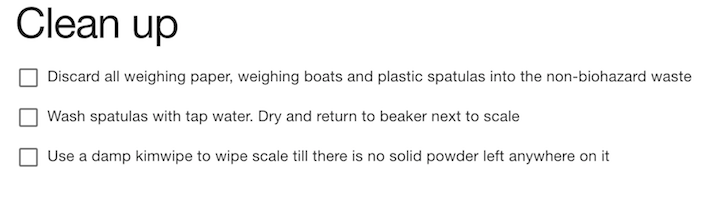

# Protocol Tutorial

This is an introduction to writing protocols for Aquarium in the Krill domain specific langauge.
We try to introduce the most common (and recommended) patterns in Krill, but this is not a comprehensive reference.
See the [API documentation](../api/index.html) for more details on the functions that Krill provides.

If you haven't already, visit the [protocol development documentation](index.md) for information about getting started.

---

## Table of Contents

- [Protocol Tutorial](#protocol-tutorial)
  - [Table of Contents](#table-of-contents)
  - [The Basic Protocol](#the-basic-protocol)
  - [Running a Protocol](#running-a-protocol)
  - [Creating Technician Instructions](#creating-technician-instructions)
  - [Working with the Aquarium Inventory](#working-with-the-aquarium-inventory)
    - [Database Queries](#database-queries)
    - [Sample](#sample)
      - [Attributes](#attributes)
      - [Associations](#associations)
    - [Object Type (a.k.a. Container)](#object-type-aka-container)
    - [Item](#item)
      - [Attributes](#attributes)
      - [Associations](#associations)
      - [Instance methods](#instance-methods)
    - [Collection](#collection)
      - [Additional associations](#additional-associations)
      - [Additional instance methods](#additional-instance-methods)
    - [Provisioning Items](#provisioning-items)
    - [Creating Items and Samples](#creating-items-and-samples)
    - [Creating Collections](#creating-collections)
  - [Managing Operations](#managing-operations)
  - [Protocol Patterns](#protocol-patterns)
    - [Protocols that Create New Items](#protocols-that-create-new-items)
    - [Protocols that Measure Items](#protocols-that-measure-items)
    - [Protocols that Modify Items](#protocols-that-modify-items)
  - [Building Libraries](#building-libraries)

---

## The Basic Protocol

A protocol is a Ruby class named `Protocol` with a `main` method that includes code that defines what happens in the protocol.
A simple example is

```ruby
class Protocol
  def main
    show { title "Getting Started" }
  end
end
```

where the body of `main` displays a single page titled "Getting Started".
When the protocol is started, Aquarium extends the Protocol class with the Krill methods described below.

## Running a Protocol

You'll probably want to follow along with the examples as you go through this tutorial.
To do this, decide on a category name for your operation types.
An obvious name is `tutorial`, but if you are working on a shared Aquarium you'll need to be more creative.

[ADD instructions]

## Creating Technician Instructions

The primary goal of a protocol is to display the instructions that technicians follow.
Each screen is created by a `show`-block that indicates what is to be displayed.
For instance, the following show block provides instructions to clean up after using a scale in a protocol:

```ruby
show do
  title "Clean up"

  note "Discard all weighing paper, weighing boats and plastic spatulas into the non-biohazard waste"
  note "Wash spatulas with tap water. Dry and return to beaker next to scale"
  note "Use a damp kimwipe to wipe scale till there is no solid powder left anywhere on it"
end
```

The words `title` and `note` are functions that determine the appearance of the text on the constructed page.
This example renders as


We could also use `bullet` here instead of `note` for the list of tasks.
However, we want to have the techinician confirm each step, and so use `check` instead:

```ruby
show do
  title "Clean up"

  check "Discard all weighing paper, weighing boats and plastic spatulas into the non-biohazard waste"
  check "Wash spatulas with tap water. Dry and return to beaker next to scale"
  check "Use a damp kimwipe to wipe scale till there is no solid powder left anywhere on it"
end
```

which gives the output



where the technicians must tap each checkbox before they can move to the next page.

There are several other style functions that can be used in a `show`-block that are covered later.

## Working with the Aquarium Inventory

Aquarium represents biological specimens in an intuitive way. Any unique item in the lab will be represented by an `Item` object. For Example, a W303alpha yeast culture in a petri dish on the lab bench would be represented by an `Item`.
The state of an `Item` is composed of a `Sample`, a `ObjectType`, and a location String.

We can think of a `Sample` as comprising the _biological specimen_ in the `Item`, while the `ObjectType` represents the type of _physical container which holds that specimen_. The location field will allow the lab staff to know where to find the `Item`. To reiterate: an `Item` is a unique instantiation of a `Sample` inside an `ObjectType`.

The `Item` representing the earlier example of a W303alpha yeast culture in a petri dish on the lab bench would have the following state:

* The `Sample` is 'W303alpha'
* The `ObjectType` is 'Yeast Plate'
* The **location** is 'Lab bench'

### Database Queries

Within a protocol, often it is necessary to bring an item, sample, object type, etc from the database into the protocol namespace as a variable, in order to access its fields or modify it. 

Any aquarium object can be directly recovered from the database with its id or name using the Object.find(), and Object.find_by_name() static methods respectively. Find returns the first item in the list of all items with the given attribute.
For example, finding item with id 1234:
```ruby
itm = Item.find(1234);
```
And finding item with name 'My favorite W303alpha':
```ruby
itm = Item.find_by_name('My favorite W303alpha');
```

We can also recover a list of objects that satisfy a given attribute using Object.where(). 
For example, getting all items with location bench:
```ruby
itms = Item.where(location: 'Bench')
```
We could also get all samples with sample_type 'Yeast Strain' :
```ruby
yeast_strain_st = SampleType.find_by_name('Yeast Strain')
samps = Sample.where(sample_type: yeast_strain_st)
```
It is possible to construct powerful and complex queries with active record finder methods by chaining queries. To collect all items that contain samples of sample type yeast strain, excluding ones that are marked as deleted, we could use the following query:
```ruby
ys_itms = Item.where(sample: Sample.where(sample_type: yeast_strain_st)).where('location != deleted')
```

In depth documentation on how to use the activerecord query interface can be found [here](http://guides.rubyonrails.org/v3.2.21/active_record_querying.html).

### Sample

A specific (yet still abstract) specimen in the lab inventory, not to be confused with a sample type (more abstract) or an item (more specific)
Suppose **s** is a sample.

#### Attributes

* **s.id** - The unique id of the sample
  * W303alpha has id 30
* **s.name** - The String name of the sample
  * We have been refering to the W303alpha sample by its name

#### Associations

* **s.properties** - Samples have many additional information fields associated with them, called properties.

  * We can access properties with **s.properties** as in:

  ```ruby
  mating = s.properties["Mating Type"]
  ```

* **s.sample_type** - A Sample Belongs to a `SampleType` that defines what properties the sample can have
  * The `SampleType` for W303alpha is 'Yeast Strain'
  * The 'Yeast Strain' `SampleType` defines a 'Mating Type' property

A helpful sample function is **s.make_item**(object_type_name) - Returns an item associated with the sample and in the container described by object_type_name. The location of the created item is determined by the location wizard.

As seen below from the inventory view, the W303alpha `Sample` has an property specifying that its 'Mating Type' is 'alpha'


The same sample can be used for multiple items.
As seen below from the inventory view, one such item that the W303alpha `Sample` is used in, is an `Item` with id '14014,' at location 'M80.1.9.0,' with `ObjectType` 'Yeast Glycerol Stock'


### Object Type (a.k.a. Container)

The type of container which holds a `Sample` in an `Item`. An object type might be named 'Yeast Plate' or '1 L Flask' If **o** is an ObjectType, then **o.name** returns the name of the object type, as in 'Yeast Plate'

Object types have a **handler** attribute, which is used to categorize them.

Object types have associated **[location wizards](#location_wizards)**, which can automatically assign locations to items of that object type. For example, it is helpful to have all items with object type 'plasmid glycerol stock' to automatically have a location in the M80 freezer.

### Item

A physical item in the lab. It belongs to an `ObjectType` and may belong to a `Sample` (see the examples below). Suppose **itm** is an `Item`

#### Attributes

* **id** - the id of the Item. Every Item in the lab has a unique id that can by used to refer to it (see finding Items and Samples).

* **location** - a string describing the physical location in the lab where the Item's physical manifestation can be found. The location of an item can be modified in a protocol with **itm.move_to**, as in:


```ruby
itm.move_to("The big red barn.")
```

#### Associations

* **itm.object_type** - the ObjectType associated with the Item.

* **itm.object_type_id** - the id of the ObjectType associated with the Item.

* **itm.sample** - the corresponding Sample, if any. Some Items correspond to Samples and some do not. For example, an Item whose object type is "1 L Bottle" does not correspond to a sample. An item whose ObjectType is "Plasmid Stock" will have a corresponding Sample, whose name might be something like "pLAB1".

* **itm.sample_id** - the id of the Sample that may be associated with the Item.

#### Instance methods

* **itm.save** - saves **itm** to the database. If you make changes to an Item's attributes or associations, you may have to call `itm.save` to save the changes to the database (see below).

* **itm.reload** - reloads an item from the database. If **itm** has changed in the database, call this method to be sure that you are working with the current data.

* **itm.mark_as_deleted** - records that the **physical manifestation** of the item has been discarded. (_DO NOT_ use `itm.delete` as this removes the Item from the database altogether.) `itm.mark_as_deleted` saves to the database automatically, and does not require a subsequenquent `itm.save` call.

You can associate arbitrary data, such as a measurement or uploaded data file, with an item using the DataAssociation model, described [here](md-viewer?doc=DataAssociation).

### Collection
A special type of `Item` associated with certain object types that allows for more than one associated sample. For example, an item created with a 'stripwell' object type will be a `Collection` capable of holding 12 samples. 

**`Collection` inherits all associations, attributes, instance methods from `Item`**, and it has the following additional associations and methods. Suppose **coll** is a collection.

#### Additional associations

* **coll.matrix** - the `Collection`'s equivalent to itm.sample. It is a matrix of `Sample` ids, which represent the samples that are used in the collection, and their location (assuming a grid like container).
  * The sample matrix is immutable. A `Collection`'s sample matrix cannot be changed, but can be replaced using **coll.matrix = m**
  * Empty slots in the matrix are represented by `-1`
* **coll.dimensions** - the row, column dimensions of the `Collection`'s sample matrix as a tuple array, [r, c]
  * For a stripwell with 12 wells, col.dimensions => [1, 12]

#### Additional instance methods

* **coll.matrix[r, c]** - Get the [r,c] entry of the matrix as a sample id

* **coll.set r, c, s** - Set the [r,c] entry of the matrix to id of the Sample **s**. If **s**=nil, then the [r,c] entry is cleared.

* **coll.num_samples** - Returns the number of non empty slots in the matrix.

* **coll.empty?** - Whether the matrix is empty

* **coll.full?** - Whether the matrix has no empty slots

<details> 
  <summary> Advanced Collection Methods </summary>

  ---

  * **coll.apportion r, c** - Sets the matrix for the collection to an empty rxc matrix and saves the collection to the database. Whatever matrix was associated with the collection is lost.

  * **coll.next r, c, opts={}** - With no options, returns the indices of the next element of the collections, skipping to the next column or row if necessary. With the option skip_non_empty: true, returns the next non empty indices. Returns nil if [r,c] is the last element of the collection.

  * **coll.non_empty_string** - Returns a string describing the indices of the non empty elements in the collection. For example, the method might return the string "1,1 - 5,9" to indicate that collection contains samples in those indices. Note that the string is adjustd for viewing by the user, so starts with 1 instead of 0 for rows and columns.
  
  * **coll.select &block** - Returns set of [r,c] such that the block is true. 

  * **coll.find x** - Finds set of [r,c] that equal **x**, where **x** can be a Sample, Item, or integer.

  * **coll.include? x** - Whether the matrix includes **x**.

  * **coll.get_empty** - Returns set of [r,c] that are EMPTY

  * **coll.get_non_empty** - Returns set of [r,c] that are not EMPTY

  * **coll.add_one x, reverse: false** - Adds **x** to the first empty [r,c]. If reverse: true, adds **x** to the  last empty [r,c]. 

  * **coll.subtract_one x, reverse: true** - Find last [r,c] that equals **x** and sets to EMPTY. If **x.nil?** then it finds the last non_empty slot. If reverse: false then finds the first [r,c] equal to x. Returns **[r,c,sample_at_rc]** if x is in collection or **nil** if **x** is not found or the col.empty?

  * **coll.remove_one x, reverse: true** - Synonym for subtract_one

  * **remaining = col.add_samples sample_list** - Fills collection with samples from sample list. Once filled, returns the remaining samples. The sample list can contain Samples, Items, or integers.

    **Collection helper methods:**

  * **load_samples headings, ingredients, collections //optional block//**

    * This helper function displays a table to the user that describes how to load a number of samples into a collection. The argument **headings** is an array of strings that describe how much to transfer of each ingredient. The argument **ingredients** is an array of array of **Items** to be transfered. The argument **collections** is an array of collections. And **block** is an option **show** style block. Note that this function *does not* change the matrix associated with the collection. This is because the sample that is created by combining the ingredients is likely different than the **Samples** associated with the ingredients. For example, the code below shows the user a table that describes how to arrays of templates, forward primers, and reverse primers into a set of stripwell tubes. The stripwells, after a PCR reaction is run, will contain fragment samples, which should be associated with the collections in a separate step.

    ```ruby
    load_samples(
      [ "Template, 1 µL", "Forward Primer, 2.5 µL", "Reverse Primer, 2.5 µL" ],
      [  templates,        forward_primers,          reverse_primers         ],
      stripwells ) {
        note "Load templates first, then forward primers, then reverse primers."
        warning "Use a fresh pipette tip for each transfer."
      }
    ```

  * **show : transfer x, y, routing**

    * One of the functions available within a show is **transfer**. The arguments x and y should be collections, and routing is a list of from, to, volume triples. Volume is optional. As an example, you can do

    ```ruby
    routing = [
      { from: [0,0], to: [0,0], volume: 10 },
      { from: [0,1], to: [1,1] }
    ]

    show do
      title "Transfer"
      transfer x, y, routing
    end
    ```

  * **transfer sources, destinations, options={} //optional block//**

    * This powerful method displays a set of pages using the transfer method from show to the user to that describe how to transfer the individual parts of some quantity of source wells to some quantity of destination wells. The routing arguments are computed automatically. For example, suppose you want the user to transfer all the wells in a set of stripwell tubes into the non-empty lanes of a set of gels. Then you might do something like

    ```ruby
    transfer( stripwells, gels ) {
      note "Use a 100 µL pipetter to transfer 10 µL from the PCR results to the gel as indicated."
    }
    ```

  * **distribute collection, object_type_name, options = {} //optional block//**

    * This method is the opposite of **load_samples**. It returns an array of new items that are made from the samples in the collection. The object type of the items is defined by the **object_type_name** argument. The only option to the method is **:except**, which should be a list of collection indices to skip. For example, suppose you had a gel with ladder in lanes (1,1) and (2,1) and you wanted to make gel fragments from the lanes. You could do

    ```ruby
    slices = distribute( gel, "Gel Slice", except: [ [0,0], [1,0] ], interactive: true ) {
      title "Cut gel slices and place them in new 1.5 mL tubes"
      note "Label the tubes with the id shown"
    }
    ```
---
</details>


### Provisioning Items

If a protocol has a list called, say, **items** returned by **find**, that does not mean the user of the protocol necessarily has taken those items from their locations and brought them to the bench. To tell the user to take the items, one must call take. The effect is to associate the item with the job running the protocol, until it is released (see below). It also "touches" the item by the job, so that one can later determine that the item was used by the job.

There are several forms of take. To illustrate them, suppose we have a list of items obtained from **find** as follows

```ruby
items = find(:item, { sample: { name: "pLAB1" }, object_type: { name: "Plasmid Stock" } } )
```

The most basic form of take is simply to do

```ruby
take items
```

which silently (i.e. without telling the user) takes the items. One may also tell the user to take them, which shows the user a page that says where the items are.

```ruby
take items, interactive: true
```

If there are more instructions to give the user, you can add an extra **show** block, as in

```ruby
take(items, interactive: true) {
  warning "Do not leave the freezer open too long!"
}
```

Finally, there is a method of taking a long list of items that goes through freezer boxes in a reasonably intelligent way, so as to reduce the number of freezer door openings and closings. This form of take looks like

```ruby
take items, interactive: true,  method: "boxes"
```

which displays a new page to the user for every freezer box required to take the items. A diagram of the freezer box is shown and the user can check the items as (s)he takes them. Any items not in freezer boxes are displayed in a final page that simply lists the remaining items and their locations.

If the object type of an item has handler 'collection', it will be useful to have access to the collection methods. To promote an item **i** to a collection, use

```ruby
c = collection_from i
```

And likewise, for a list of items

```ruby
colls = items.map { |i| collection_from i }
```

Note that when the protocol is done with the items, it should release them. The simplest form for release is

```ruby
release items
```

### Creating Items and Samples

To make new items you use either **new_object** or **new_sample**, which both return Items. Typically, these functions are used with the **produce** function so that the items returned are (a) put in the databased with new unique ids and (b) associated with the job (i.e. they are "taken").

* **new_object name** - This function takes the name of an object type and makes a new item with that object type. An object type with that name must exist in the database. For example, you might do the following, which would return a new item in the variable **i**.

  ```ruby
  i = produce new_object "1 L Bottle"
  ```

* **new_sample sample_name, of: sample_type_name, as: object_type_name** - This function takes a sample name and an object type name and makes a new item with that name. For example, you might do the following, which returns a new item in the variable **i** whose object type is "Plasmid Stock", whose corresponding sample is "pLAB1" and whose sample type is "Plasmid".
  ```ruby
  j = produce new_sample "pLAB1", of: "Plasmid", as: "Plasmid Stock"
  ```
  
  When a protocol is done with a an item, it should release it. This is done with the release function.

* **release item_list, opts={} //optional block//** -- release an item. This function has many forms. Suppose **i** and **j** are items currently ''taken'' by the protocol.

  ```ruby
  release([i,j])
  ```

  * ^ This version of release simply release the items i and j (i.e. it marks them as not taken by the job running the protocol).

  ```ruby
  release([i,j],interactive: true)
  ```

  * ^ This version calls **show** and tells the user to put the items away, or dispose of them, etc. Once the user clicks "Next", the items in the list are marked as not taken.

  ```ruby
  release([i,j],interactive: true) {
    warning "Be careful with these items."
  }
  ```

  * ^ This version also calls **show**, like the previous version, but also adds the **show** code block to the **show** that release does, so that you can add various notes, warnings, images, etc. to the page shown to the user.

### Creating Collections
Collections can be made manually by making a new item with a collection-friendly object type as above, and promoting it to a collection. You can also use the following static Collection methods for convienence
* **Colllection.new_collection "collection_type_name"** - Creates a new collection of type "collection_type_name" with a matrix of size defined by the rows and columns in the collection type.

* **Colllection.spread sample_list, "collection_type_name"** - Creates an appropriate number of collections of "collection_type_name" and fills collections with the sample_list. The sample list can be Samples, Items, or integers.

## Managing Operations

Protocols also manage how a batch of operations using the protocol will be performed.
A protocol is able to refer to a batch of operation using the symbol `operations`.

A simple protocol will apply the same tasks to each operation.
For instance, this protocol [DOES SOMETHING]

```ruby
class Protocol
  def main
    operations.each do |operation|
      operation_task(operation)
    end
  end

  def operation_task(operation)
    show do
        title "MAKE A REALISH EXAMPLE"
    end
  end
end
```

The `operation_task` helper function defines the tasks for an operation. Organizing the code this way separates the part of the protocol that operates over all operations from the part that operates over an individual operation.

This _single operation_ idiom is useful, but there may be other scenarios where a _grouped operation_ idiom is better.

```ruby
class Protocol
  def main
    groups1, groups2 = make_groups(operations)

    operation_group_1_task(group1)
    operation_group_2_task(group2)
  end

  def make_groups(operations)
  end

  def operation_group_1_task(operation_group)
    show do
        title "MAKE A REALISH EXAMPLE"
    end
  end

  def operation_group_1_task(operation_group)
    show do
        title "MAKE A REALISH EXAMPLE"
    end
  end
end
```

## Protocol Patterns

Most protocol tasks fall into one of three categories:

* Tasks that take input items and use them to create output items,
* Tasks that modify their input items, and
* Tasks that measure their input items, producing files.

### Protocols that Create New Items

The most common form of protocol takes input items and generates output items.
Such protocols will follow these general steps:

1.  Tell the technician to get the input items.
2.  Create IDs for the output items.
3.  Give the technican instructions for how to make the output items.
4.  Tell the technician to put everything away.

We saw earlier that we can write protocols that do these steps at a detailed level, but Aquarium provides functions that will do them over the inputs and outputs of the batched operations.
So, we can write the protocol to manage these tasks relative to the batched operations, which is simpler.

A protocol is able to refer to a batch of operation using the symbol `operations`, and calls `operations.retrieve`, `operations.make` and `operations.store` to perform the steps above.

As an example, the following protocol illustrates this pattern for [DOING SOMETHING].

```ruby
def main
  # 1. Locate required items and display instructions to get them
  operations.retrieve
  # 2. Create inventory items for the outputs
  operations.make

  operations.each do |operation|
    # 3. Instructions how to perform steps to produce results
    operation_task(operation)
  end

ensure
    # 4. Put everything away
    operations.store
end
```

The use of `ensure` in this example makes certain that `operations.store` is called even if an exception is raised by the call to `operation_task`.

[Accessing Inputs and Outputs]

```ruby
def operation_task(operation)
  show do
    title "MAKE A REALISH EXAMPLE"
  end
end
```

### Protocols that Measure Items

Another common protocol uses an instrument to measure a sample.
Instruments frequently save the measurements to a file, and so the protocol consists of instructions for first taking the measurement, and then uploading the file(s).

[data associations]

### Protocols that Modify Items

[handling time: timers vs scheduling]

## Building Libraries

[saving work with shared functions - include, extend, direct call]

[simplifying with kinds of ducks: using classes]

[things that go awry: show blocks in libraries]
